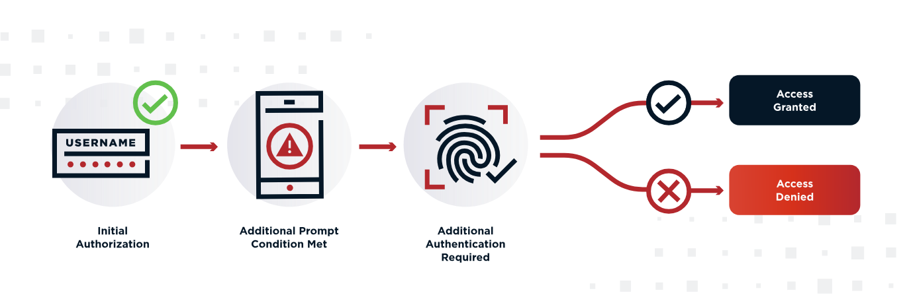
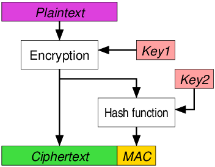
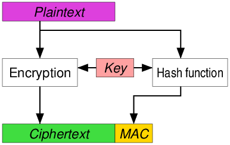
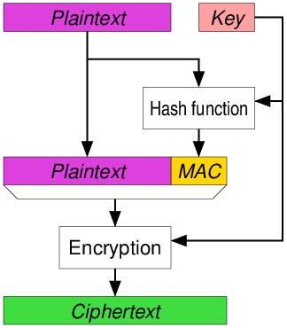

# auth-middleware

an access token represents delegated access to a protected resource. RFC 6749 describes OAuth as a framework for giving a client limited access to an HTTP service, either on behalf of a resource owner or on the client’s own behalf

Your backend API only ever receives access tokens, so the middleware validates exactly that: RFC 9068 JWT access tokens, plus the OAuth-family extensions (RFC 6750 Bearer, RFC 9449 DPoP, RFC 8705 mTLS, RFC 9470 step-up).

It actively defends against ID tokens. An ID token is also a signed JWT from the same issuer, so a naive validator would accept one sent to the API ("ID-token replay"). Restricting `acceptedTokenTypes` to `at+jwt` in `AccessTokenConfig.scala` makes that structurally impossible — ID tokens have `typ: JWT`. The default also accepts plain JWT for issuers that don't emit `at+jwt` yet, so tighten it if yours does 

`"OAuth is authorization, not authentication" describes the protocol's purpose between user, client, and authorization server — not what happens at your API`

At the protocol layer: OAuth's job is delegation. The user authorizes a client app to act on their behalf, and the access token is the artifact of that consent. The famous warning "don't use OAuth for authentication" targets a specific historical mistake: client apps treating possession of an access token as proof that a user logged in. Tokens aren't audience-restricted to the client, so a malicious site could replay a token it received and impersonate the user elsewhere. OIDC's ID token — `audience-locked`, with `nonce` — was created precisely to fix that. That warning is about login at the client, and it's real, but it's not about resource servers

`The original warning was aimed squarely at front-end developers and client applications to prevent the "Confused Deputy" problem.`

`aud `(audience) claim matching the client ID and a `nonce` to prevent replay attacks. The ID Token was explicitly built for client-side user authentication

When an API rejects an invalid or missing token, it doesn't return a `403 Forbidden` (which represents an authorization failure). It returns a `401 Unauthorized` accompanied by the `WWW-Authenticate: Bearer` header. The HTTP specification itself categorizes the validation of a bearer token as an authentication event.

`Access tokens are not audience-restricted to the OAuth client; when they are audience-restricted, the intended audience is the resource server/API, not the client application using them.`

- OAuth 2.0 is an authorization framework — it exists to delegate access.
- Within that framework, the resource server authenticates each request by validating the token, then authorizes it via scopes/acr.
- OIDC is for user authentication at the client 

OpenID Connect requires the ID Token’s `aud` claim to contain the OAuth client’s `client_id`, and the client must reject the ID Token if it is not listed as a valid audience. It also defines `nonce` to bind the ID Token to a particular client login request and mitigate replay.


There's also a chronological reason the old warning was phrased so absolutely. In original OAuth 2.0 (RFC 6749, 2012), access tokens were opaque — unspecified format, often just a random string. A client literally couldn't inspect any aud, because there was no structure to read. Audience-restricted and JWT-structured access tokens only got standardized later (Resource Indicators RFC 8707 in 2020, the JWT access-token profile RFC 9068 in 2021).

The ID token's `aud` is set to the `client_id` of the receiving app:
- Alice's ID token from EvilBlog has `aud: "evilblog-client-id"`.
- PhotoApp checks `aud == "photoapp-client-id"` → mismatch → rejected. Replay dead.
So both token types have an `aud` claim — but they point at different kinds of party:

| Token | `aud` points at | Useful for answering |
| --- | --- | --- |
| Access token | the API / resource server | "may this token be used at this API?" |
| ID token | the client app (`client_id`) | "was this login minted for this app?" |


"Mint" just means create/generate/issue — like a mint stamps coins. A value you mint is one your own code produces and emits into the world; a value you receive is one that arrives from someone else and you have to inspect.

- The authorization server mints an `access_token`, a `jti`, an `authorization_code`, a `request_uri`. It chooses the format — say, a 32-byte random value, base64url-encoded, 16–256 chars. Since you generate it, you can guarantee that shape, so the type can be strict (`MintedJti = [A-Za-z0-9._~-]{16,256}`), and you can construct it with a total/compile-time constructor because you'll never feed it garbage.

- The resource server receives an `access_token` in the `Authorization` header, and reads the `jti`, `sub`, and `scope` claims out of it. You didn't make these. Some other authorization server did, and the spec (RFC 7519 ) lets it put almost anything non-blank in a `jti`.

| Newtype | Who authors it | Type strictness | How you build it |
| --- | --- | --- | --- |
| **TokenJwtId** (mint) | your AS generates it | strict (16–256, fixed charset) | total / trusted |
| **ReceivedJwtId** (receive) | a peer put it in a token | lenient (non-blank, ≤256) | Either (validate, can reject) |

- You mint a route requirement: `Custom(ScopeToken("partner:settlement"))`. You author that string in your own source code, so the curated strict grammar applies and it's validated at compile time — you're the authority, so a violation is your bug to fix now.
- You receive granted scopes: the scope claim from an incoming token, parsed leniently through Inbound.scopes, dropping anything malformed — because a peer authored those and might send something off-spec.

## InMemoryDPoPSingleUseChecker
It's two things: a map and a timer (source).

The replay check — a ConcurrentHashMap<String, Long> from key → insertion timestamp, where the key is i`ssuer + ":" + base64url(SHA-256(jti))`:

```java
public void markAsUsed(DPoPProofUse use) throws AlreadyUsedException {
  String key = use.getIssuer() + ":" + computeSHA256(use.getJWTID());
  if (cachedJTIs.putIfAbsent(key, now) != null)   // atomic check-and-set
    throw new AlreadyUsedException("Detected jti replay");
}
```
`putIfAbsent `is the whole game: if the key was already there, it's a replay → throw. Atomic, so concurrent duplicate proofs can't both slip through.

The eviction — a dedicated `java.util.Timer` (one daemon thread per checker) that wakes every `purgeIntervalSeconds` and does a full `O(n)` scan, deleting entries older than `lifetimeSeconds`:

```java
timer.schedule(new TimerTask {
  run() { for (e <- cachedJTIs) if (e.value < now - lifetime) cachedJTIs.remove(e.key) }
}, purgeInterval, purgeInterval);
```
`shutdown()` just calls `timer.cancel()` — that's the thread you have to remember to stop, which is why I wrapped it in `Resource`.


## Caffeine
Look at the Caffeine version's `markAsUsed`: it's the same `ConcurrentHashMap` + `putIfAbsent` + `the same issuer:SHA-256(jti)` key. It even copies `computeSHA256` verbatim. So Caffeine adds zero to the replay detection or the security property — both are correct and identical.

What changes is the eviction strategy — Nimbus's periodic timer-thread sweep is replaced by Caffeine's per-entry expiry, evicted lazily during normal cache operations (and amortized on the shared `ForkJoinPool`, not a dedicated thread).

- Nimbus runs a dedicated `Timer` thread that, every `purgeIntervalSeconds`, does a full `O(n)` scan of the entire map and removes expired entries. Two costs follow:
  1. A recurring CPU burst proportional to the map size — at high request rates (lots of unique `jti`s inside the retention window), that scan walks every entry on a timer.
  2. Between purges the map holds all entries, including already-expired ones, so memory runs higher than the live set and the larger map makes every lookup touch a bigger structure.
- Caffeine evicts incrementally, amortized `O(1)`, piggybacked on normal cache operations (no dedicated thread, no periodic full sweep). Memory tracks the true live set, and there's no recurring scan spike. It's engineered for high-concurrency hot paths (batched read/write buffers, minimal contention).

Under sustained high load — which is exactly when a payments API gets hammered or when someone floods you with proofs — Nimbus's periodic full-map scan and inter-purge memory growth are the performance hazard, and Caffeine avoids both.

RFC 9068 (the JWT access-token profile) technically lists `sub` as required, and for `client_credentials` it recommends setting `sub` to the client's identifier. So a strictly-9068-compliant AS does still emit a `sub` (= client id).

`jti` is the JWT ID claim (RFC 7519 §4.1.7): a string the issuer puts in a token that uniquely identifies that one token. The issuer assigns it so two tokens essentially never share a `jti` (typically a UUID or random value). Its stated purpose in the spec is to prevent replay 

A DPoP proof is meant to be minted fresh per request to prove possession of the key. Its `jti` is how the resource server enforces "use once":
- The single-use checker (the `InMemoryDPoPSingleUseChecker` / Caffeine thing) records each proof's `jti` (keyed as issuer:SHA-256(jti)). If the same `jti` shows up twice, it's a replay of a captured proof → rejected.
- That's literally `putIfAbsent` on the `jti`: first time wins, second time fails.

## The problem DPoP solves
A normal Bearer token is exactly that — `bearer`: whoever holds the string can use it. Steal it (leaky log, malicious proxy, compromised TLS terminator) and you can replay it anywhere until it expires. DPoP (RFC 9449) makes the token `sender-constrained`: it ties the token to a key the legitimate client holds, so a stolen token alone is useless — you'd also need the client's private key.

## Dpop
The client generates a key pair and keeps the private key. Two phases:
1. *Issuance* — bind the token to the public key. When the client gets the access token, the authorization server stamps a confirmation claim into it: `cnf.jkt = SHA-256 thumbprint` of the client's public key. That's the token saying "I may only be used by whoever can prove they hold the key with this thumbprint." (In our middleware this becomes `AuthContext.confirmation = ConfirmationClaim.DPoP(jkt)`.)

2. *Each request — prove possession*. The client sends two headers:
```sh
Authorization: DPoP <access-token>
DPoP: <proof-jwt>
```

The proof is a small JWT the client mints per request, signed with its private key, that:
- carries the public key in its `jwk` header (so the server can verify the signature and compute the thumbprint), and
- has claims `htm` (HTTP method), `htu` (the request URL), `iat` (issued-at), `ath` (hash of the access token), and `jti` (a unique id for this proof).

## What the resource server verifies (Nimbus verifier)
- The proof's signature checks out against its embedded `jwk` → the sender holds the private key.
- `SHA-256(jwk) == token's cnf.jkt `→ this proof's key is the one the token is bound to. (Forgery defense: an attacker with the stolen token but not the key can't produce a jwk that thumbprints to cnf.jkt.)
- `htm/htu` match this request's method and URL → the proof was made for this endpoint.
- `iat` is fresh (within the max-age window) → not an old proof.
- `ath` == hash(access token) → the proof is bound to this specific token.
- `jti` has not been seen before → the proof is used at most once.


The proof JWT (the value of the DPoP: header) carries:
- `htm` = HTTP method → the server compares it against the request's actual method (GET, POST, …).
- `htu` = HTTP target URI (the endpoint/URL) → the server compares it against the request's actual URL (`scheme + host + path`; query and fragment are stripped first).
Both must match, or the proof is rejected (`invalid_dpop_proof`).

Why both claims exist: `they bind the proof to one specific operation`. A proof captured for `GET /accounts` can't be replayed as `POST /payments` (wrong `htm` and `htu`), and a proof for `https://api.example.com/...` can't be aimed at a different host. Combined with `ath` (binds to the specific token) and `jti` (one-shot), the proof is pinned to exactly: this method, this URL, this token, once, within the freshness window

`OAuth 2.0 is a framework for delegated authorization, and the access token is the artifact that delegation produces`

The access token is just how that grant is represented and carried
`the token carries authorization, but verifying the token is genuine is authentication — and you can't act on what a credential permits until you've confirmed the credential is real.`

At the resource server, the first question is: is this token genuine? Real signature from my trusted AS, intact, unexpired, for my audience, (with DPoP/mTLS) presented by the party it's bound to. Verifying that a presented credential is authentic is authentication — the same way checking a password or a client certificate is.

`Checking that the grant is real is authentication; acting on what it permits is authorization. Authorization presupposes authentication `

In our middleware, every DPoP outcome is an authentication outcome:
- missing / invalid / replayed proof → `invalid_dpop_proof` → 401
binding violation (bound token presented as Bearer, thumbprint mismatch) → `invalid_token` → 401
- "must be sender-constrained" → `invalid_token` → 401
- None of them produce 403 `insufficient_scope`. Authorization failures are 403; DPoP failures are 401.


authentication" = proving genuineness (of the client, the request, the flow, the token's possessor, or the user), and "authorization" = defining, scoping, delegating, or revoking what access is granted. Also note where each acts — many strengthen authentication at the authorization server / flow layer, a few at the resource server.

## Strengthen AUTHENTICATION

| Extension | RFC | What it strengthens / where |
| --- | --- | --- |
| PKCE | 7636 | Binds code redemption to the client that started the flow (anti code-interception) — flow/request auth at the AS |
| mTLS | 8705 | Two parts: client auth to the AS via TLS cert and certificate-bound (PoP) access tokens — client + request auth |
| DPoP | 9449 | Application-layer proof-of-possession; sender-constrains the token — request auth at the RS |
| cnf confirmation | 7800 | The PoP-binding representation (`jkt`, `x5t#S256`) underpinning DPoP/mTLS — request auth |
| Assertion framework / JWT / SAML client auth | 7521 / 7523 / 7522 | `private_key_jwt` etc. — client authenticates to the AS with a signed assertion — client auth |
| PAR (Pushed Authorization Requests) | 9126 | Auth request pushed server-side, tied to an authenticated client, untamperable in the front channel — request authenticity |
| JAR (JWT-Secured Authorization Request) | 9101 | Signs/encrypts the auth request — request authenticity/integrity |
| Issuer Identification | 9207 | `iss` in the authz response; defeats AS mix-up — response authenticity |
| Step-up Authentication Challenge | 9470 | Demands stronger/fresher user auth (`acr`/`max_age`) — user-auth strength |
| JWT Profile for Access Tokens | 9068 | Structured tokens the RS can authenticate locally (signature/`iss`/`aud`/`exp`) — enables request/token auth |
| HTTP Message Signatures | 9421 | Signs HTTP messages (used by FAPI) — message/request authenticity |
| Native Apps BCP | 8252 | Secure the flow (system browser + PKCE) — flow auth |
| (OIDC Core / ID Token — layered on OAuth) | — | The user-authentication layer OAuth itself omits — user auth |

## Strengthen AUTHORIZATION

| Extension | RFC | What it strengthens / where |
| --- | --- | --- |
| Rich Authorization Requests (RAR) | 9396 | `authorization_details` — fine-grained, structured authz beyond scopes — grant precision |
| Resource Indicators | 8707 | `resource` param → audience-restricted tokens — scopes where a token may be used |
| Token Exchange | 8693 | Delegation / impersonation (act-as / on-behalf-of) — delegated authz |
| Token Revocation | 7009 | Client revokes a grant — authz lifecycle (un-grant) |
| Device Authorization Grant | 8628 | A flow to obtain authorization on input-limited devices — authorization grant |

## Hybrid (do both)

| Extension | RFC | Note |
| --- | --- | --- |
| Token Introspection | 7662 | RS asks the AS "is this token active/genuine?" (authentication of the token) and gets its scopes (authorization) |
| Security BCP | 9700 | Cross-cutting hardening — mandates PKCE, sender-constraining, no implicit, etc. (both sides) |
| FAPI 1.0 / 2.0 profiles | — | Combine many of the above into a high-assurance profile (both) |

## Supporting / operational (neither directly)

| Extension | RFC | Note |
| --- | --- | --- |
| AS Metadata / Discovery | 8414 | How clients discover endpoints/capabilities |
| Dynamic Client Registration / Management | 7591 / 7592 | Establishes client identity (an authn foundation) but is operational |
| Bearer Token Usage | 6750 | The baseline request authentication (the weak, stealable form that DPoP/mTLS strengthen) |

The authentication-strengthening extensions cluster around three proof-of-possession ideas — proving the client is real (mTLS/JWT client auth), proving the request/flow is real and untampered (PKCE, PAR, JAR, issuer-id), and proving the token's holder is the bound party (DPoP, mTLS binding, cnf). The authorization-strengthening ones cluster around shaping the grant — making it more precise (RAR), narrower in audience (Resource Indicators), delegable (Token Exchange), or revocable (Revocation). Step-up and sender-constraint policy sit on the authentication side even though they gate access, because what they check is authentication strength, not a permission 

A protocol nails down the exact bytes on the wire so two independent implementations interoperate out of the box (think TLS, HTTP). OAuth 2.0 doesn't do that — it gives you a kit of parts and lets you assemble (and extend) a concrete system.

Here's what's left open, which is exactly what makes it a framework and not a protocol:
- Multiple grant types, not one handshake. Authorization code, client credentials, refresh, device, implicit (now deprecated) — you pick the flow for your situation. And it defines extension grants (the urn:ietf:params:oauth:grant-type:* mechanism), so brand-new flows like token exchange and CIBA slot in without changing the core. A protocol would specify one exchange.
- The token format is unspecified. RFC 6749 never says what an access token is — opaque string or JWT, your choice. That's why RFC 9068 (the JWT profile) exists later to fill it in. A protocol would mandate the format.
- Major details are deferred. How the resource server validates a token, which client-authentication method is used, token lifetimes, what scopes mean — the core mostly leaves these to you, to extensions, or to profiles.
- Extension points and registries everywhere. New parameters, new endpoints, new token types, new grant types — all have defined places to plug in, backed by IANA registries. The entire list of extensions(PKCE, DPoP, PAR, RAR, mTLS, …) exists because the core was built as a framework with these seams.

The practical consequence: two OAuth deployments can look quite different on the wire and both be valid OAuth — `which means OAuth alone doesn't guarantee interoperability or security`. That gap is exactly why profiles (FAPI 1.0/2.0), OpenID Connect, BCPs (RFC 9700), and OAuth 2.1 exist — they re-tighten the framework into something interoperable and secure for a given context. FAPI, for instance, says "for financial-grade, you must use PKCE + PAR + sender-constrained tokens + these algorithms" — turning the open framework into a pinned-down profile.

the framework design is what lets OAuth serve everything from a CLI script to a banking API — enormous flexibility — but that same underspecification is what produced years of insecure implementations, which the profiles and BCPs now exist to correct.

A protocol is a strict, unambiguous set of rules governing how two systems communicate. It defines the exact bits, bytes, headers, and sequence of operations. There is no room for interpretation. If you deviate from the protocol, the connection fails.

A profile takes a broad, flexible framework (or standard) and aggressively constraints it for a specific industry or use case. Frameworks offer too many choices; a profile makes those choices for you to guarantee security or interoperability in a specific domain.

`without a server nonce, proofs can be pre-generated — their freshness is bounded only by iat/max-age plus single-use. A server nonce ties each proof to a value the server minted just in time, so an attacker can't prepare proofs ahead of capture, and it gives the server tight control over freshness — especially valuable when you can't guarantee cross-node single-use replay protection `

Our `AuthMiddleware` currently produces either an authenticated request or a failure response — it doesn't shape successful responses. Issuing/rotating `DPoP-Nonce` means adding headers to outgoing responses (at minimum the `use_dpop_nonce` 401; ideally rotating on success too), which is a slightly different integration point than pure authentication.

1. RFC 9068 requires both sub and client_id, and says of sub:
In case the access token is obtained via a grant where a resource owner is not involved, such as the client credentials grant, the value of sub SHOULD correspond to an identifier the authorization server uses to indicate the client application.

2. presence of user-authentication claims (§2.2.1)
RFC 9068 §2.2.1 ("Authentication Information Claims") defines `auth_time`, `acr`, and `amr` as describing the resource owner's authentication event. They're only meaningful when a user authenticated, and are not included for grants without user authentication (client credentials). So:
- `auth_time` / `acr` / `amr` present ⇒ a user authenticated.
all absent ⇒ likely M2M

`an access token is about authorization, but authorization decisions can legitimately depend on how the user authenticated. acr/amr carry that authentication context so the resource server can make those decisions.`

## step-up authentication
`acr`: Authentication Context Class Reference
`acr_values`:parameter sent to the idp in the OIDC authorization request to tell the identity provider which authentication flow to use
`acr_values` (what you asked for) ≠ the `acr` claim (what you got). The IdP is not obligated to honor `acr_values`

`amr`: Authentication Methods References- is consumed inbound,after identity provider authenticates user.The value of `amr` claim is read from the token to determine how the user authenticated.A JSON array of strings, each naming one method that was used: `["pwd", "otp"]`, `["mfa", "hwk"]`, `["pwd", "mfa", "sms"]`. (Defined in RFC 8176, which registers values like `pwd`, `otp`, `sms`, `hwk`, `swk`, `fpt` (fingerprint), `face`, `pin`, `mfa`.)



 It is not uncommon for resource servers to require different authentication strengths or recentness according to the
   characteristics of a request

>>>
In simple API authorization scenarios, an authorization server will determine what authentication technique to use to handle a given request on the basis of aspects such as the scopes requested, the resource, the identity of the client, and other characteristics known at provisioning time.  Although that approach is viable in many situations, it falls short in several important circumstances. Consider, for instance, an eCommerce API requiring different authentication strengths depending on whether the item being purchased exceeds a certain threshold, dynamically estimated by the API itself using a logic that is opaque to the authorization server. An API might also determine that a more recent user authentication is required based on its own risk evaluation of the API request   

`insufficient_user_authentication`can be used by resource servers to signal to the client that the authentication event associated with the access token presented withthe request does not meet the authentication requirements of the resource server. `acr_values` and `max_age` parameters for the Bearer authentication scheme challenge defined by [RFC6750] can be used by the resource server to explicitly communicate to the client the required authentication
   strength or recentness.

The client can use that information to reach back to the
authorization server with an authorization request that specifies the authentication requirements indicated by the protected resource. This is accomplished by including the `acr_values` or `max_age` authorization request parameters as defined in [OIDC]

## Protocol Overview
The following is an end-to-end sequence of a typical step up authentication scenario implemented according to this specification.
The scenario assumes that, before the sequence described below takes
place, the client already obtained an access token for the protected
resource.
```sh
  +----------+                                          +--------------+
  |          |                                          |              |
  |          |-----------(1) request ------------------>|              |
  |          |                                          |              |
  |          |<---------(2) challenge ------------------|   Resource   |
  |          |                                          |    Server    |
  |  Client  |                                          |              |
  |          |-----------(5) request ------------------>|              |
  |          |                                          |              |
  |          |<-----(6) protected resource -------------|              |
  |          |                                          +--------------+
  |          |
  |          |
  |          |  +-------+                              +---------------+
  |          |->|       |                              |               |
  |          |  |       |--(3) authorization request-->|               |
  |          |  | User  |                              |               |
  |          |  | Agent |<-----------[...]------------>| Authorization |
  |          |  |       |                              |     Server    |
  |          |<-|       |                              |               |
  |          |  +-------+                              |               |
  |          |                                         |               |
  |          |<-------- (4) access token --------------|               |
  |          |                                         |               |
  +----------+                                         +---------------+
```

1. The client requests a protected resource, presenting an access token.
2. The resource server determines that the circumstances in which
the presented access token was obtained offer insufficient authentication strength and/or recentness; hence, it denies the request and returns a challenge describing (using a combination of `acr_values` and `max_age`) what authentication requirements must be met for the resource server to authorize a request.
3. The client directs the user agent to the authorization server
with an authorization request that includes the `acr_values` and/or
`max_age` indicated by the resource server in the previous step.
4. Whatever sequence required by the grant of choice plays out; this
will include the necessary steps to authenticate the user in
accordance with the `acr_values` and/or `max_age` values of the
authorization request.  Then, the authorization server returns a
new access token to the client.  The new access token contains or
references information about the authentication event.
5. The client repeats the request from step 1, presenting the newly obtained access token.
6. The resource server finds that the user authentication performed during the acquisition of the new access token complies with its requirements and returns the representation of the requested protected resource.

The validation operations mentioned in steps 2 and 6 imply that the resource server has a way of evaluating the authentication that occurred during the process by which the access token was obtained. the assessment by the resource server of the specific authentication method used to obtain a token for the requested resource is called an "authentication level". When presented with a token derived from a particular authentication method (i.e., a given authentication level) that it does not want to accept (i.e., below the threshold or level it will accept), the resource server seeks to step up (i.e.,renegotiate) from the current authentication level to one that it may accept

`insufficient_user_authentication`:  The authentication event associated with the access token presented with the request does not meet the authentication requirements of the protected resource

`acr_values`: A space-separated string listing the authentication context class reference values in order of preference.  The protected resource requires one of these values for the authentication event associated with the access token. As defined in Section 1.2 of [OIDC], the authentication context conveys information about how authentication takes place (e.g., what authentication method(s) or assurance level to meet).

`max_age`:  This value indicates the allowable elapsed time in seconds since the last active authentication event associated with the access token.  An active authentication event entails a user interacting with the authorization server in response to an authentication prompt.  Note that, while the auth-param value can be conveyed as a token or quoted-string (see Section 11.2 of [RFC9110]), it has to represent a non-negative integer

The auth-params `max_age` and `acr_values` MAY both occur in the same challenge if the resource server needs to express requirements about both recency and authentication level.  If the resource server determines that the request is also lacking the scopes required by the requested resource, it MAY include the scope attribute with the value necessary to access the protected resource, as described in Section 3.1 of [RFC6750]

## Authorization Request
A client receiving a challenge from the resource server carrying the
`insufficient_user_authentication` error code SHOULD parse the WWW-
Authenticate header for `acr_values` and `max_age` and use them, if
present, in constructing an authorization request.  This request is
then conveyed to the authorization server's authorization endpoint
via the user agent in order to obtain a new access token complying
with the corresponding requirements.  The `acr_values` and `max_age`
authorization request parameters are both OPTIONAL parameters defined
in Section 3.1.2.1. of [OIDC]. This document does not introduce any
changes in the authorization server behavior defined in [OIDC] for
processing those parameters; hence, any authorization server implementing OpenID Connect will be able to participate in the flow described here with little or no changes. See Section 5 for more details

## Authorization Response

Section 5.5.1.1 of [OIDC] establishes that an authorization server
receiving a request containing the `acr_values` parameter MAY attempt
to authenticate the user in a manner that satisfies the requested
authentication context class reference and include the corresponding
value in the acr claim in the resulting ID Token.  The same section
also establishes that, in case the desired authentication level
cannot be met, the authorization server SHOULD include a value
reflecting the authentication level of the current session (if any)
in the acr claim.  Furthermore, Section 3.1.2.1 [OIDC] states that if
a request includes the `max_age` parameter, the authorization server
MUST include the `auth_time` claim in the issued ID Token.  An
authorization server complying with this specification will react to
the presence of the `acr_values` and `max_age` parameters by including
`acr` and `auth_time` in the access token (see Section 6 for details).
Although [OIDC] leaves the authorization server free to decide how to
handle the inclusion of acr in the ID Token when requested via
`acr_values`, when it comes to access tokens in this specification, the
authorization server SHOULD consider the requested `acr` value as necessary for successfully fulfilling the request.  That is, the requested `acr` value is included in the access token if the
authentication operation successfully met its requirements; otherwise, the authorization request fails and returns an `unmet_authentication_requirements` error as defined in [OIDCUAR].  The recommended behavior will help prevent clients getting stuck in a loop where the authorization server keeps returning tokens that the resource server already identified as not meeting its requirements

This document MUST NOT be used to position OAuth as an authentication
protocol.`For the purposes of this specification, the way in which a user authenticated with the authorization server to obtain an access token is salient information, as a resource server might decide whether to grant access on the basis of how that authentication operation was performed`

## Authentication Information Claims
The claims listed in this section MAY be issued in the context of authorization grants involving the resource owner and reflect the types and strength of authentication in the access token that the authentication server enforced prior to returning the authorization response to the client. Their values are fixed and remain the same across all access tokens that derive from a given authorization response, whether the access token was obtained directly in the response (e.g., via the implicit flow) or after one or more token exchanges (e.g., obtaining a fresh access token using a refresh token or exchanging one access token for another via [RFC8693] procedures).

auth_time
    OPTIONAL - as defined in Section 2 of [OpenID.Core]. 
acr
    OPTIONAL - as defined in Section 2 of [OpenID.Core]. 
amr
    OPTIONAL - as defined in Section 2 of [OpenID.Core].

[Dynamic Step-Up Authentication: Secure Your Access](https://www.youtube.com/watch?v=Ha03XDRv1BA&t=573s)    

Resource servers (your protected APIs) can require different authentication strengths or elapsed time frames for different use cases. For example, an ecommerce app requires different authentication strengths depending on whether the item being purchased exceeds a certain threshold. Another example is an app that requires a higher level of assurance before it changes sensitive information.

step-up authentication for API access (OAuth) and application access (OpenID Connect). 

- `acr` – the Authentication Context Reference (ACR) describes the level to which authentication took place. ACR values are agreed between parties ahead of time. For example, the UK’s Open Banking uses an ACR value of urn:openbanking:psd2:sca to state that the user authenticated to the standard of Strong Customer Authentication (SCA).
- `amr` – the Authentication Method Reference (AMR) describes how the user authenticated. For example, “pwd” for password, “otp” for a one-time password, or even “mfa” to signal that Multi-Factor Authentication (MFA) took place

- `auth_time `– when the end-user last authenticated at the identity provider. This could be a few hours ago if they have a long-lived single sign-on session

[step-up-authentication](https://www.scottbrady.io/oauth/step-up-authentication)

## Step-up authentication for API access using OAuth

With OAuth, you can achieve a similar approach where an API endpoint requires a specific level of authentication. You could implement this by requiring a scope that is protected at the authorization server by step-up authentication, or you could follow a similar approach to OpenID Connect by again using the same `acr`, `amr`, and `auth_time` claims, but this time as part of the access token. 

```sh
  --server            run sbt server in the foreground, instead of using sbtn
  --client            run sbtn (native client), and start sbt server in the background
  --no-server         run sbtn, and fail if it cannot connect to a server
  --jvm-client        run JVM client, and start sbt server in the background
``` 

### Why --client (the default) is actually worse in CI
It downloads the sbtn native binary first (sbt.sh:191 acquire_sbtn) — an extra network fetch from GitHub releases that can flake or slow the job. You gain nothing, because nothing reuses that background server.

### The recommended CI invocation

`sbt --server --batch "clean; compile; test"`
`--server` — one foreground JVM that is the session, runs all batched commands, and exits cleanly. No native-client download, no background daemon to orphan. Most predictable. (sbt.sh:647)
`--batch` — disables interactive mode so nothing ever blocks waiting on a prompt (sbt.sh:667).

```scala
final case class Scope private (
    project: ScopeAxis[Reference],
    config: ScopeAxis[ConfigKey],
    task: ScopeAxis[AttributeKey[?]],
    extra: ScopeAxis[AttributeMap]
)
```
Every setting/task key in sbt isn't a single value — it's a value per scope. A scope is an address made of four axes 

- Project axis — which subproject: a specific project, ThisBuild (whole build), or "any."
- Config axis — which configuration: Compile, Test, Runtime, etc.
- Task axis — which task: e.g. scoped to packageBin or console.
- Extra axis — attribute-based, rarely used by hand.

`--server` skips the whole client/server split. It runs the JVM directly in the foreground, does its work, and exits cleanly — one process, one JVM, no background leftovers.

JSON- JOSE(Json object Signing and Encryption)

CBOR(COSE CBOR Object Signing and Encryption)

When a user approves an application's request, the Authorization Server issues an authorization grant to the client. The client then takes this grant to the token endpoint and trades it for an Access Token.
- The Grant: The proof of permission ("The user said I could access this, and here is the cryptographic proof").
- The Access Token: The actual, usable key to the API.

A grant type is simply the specific method the application uses to get that initial proof of permission

OAuth provides a method for clients to access a protected resource on behalf of a resource owner.  In the general case, before a client can access a protected resource, it must first obtain an authorization grant from the resource owner and then exchange the authorization grant for an access token.  The access token represents the grant's scope, duration, and other attributes granted by the authorization grant.  The client accesses the protected resource by presenting the access token to the resource server


Annotation order = execution order. Play runs the first-listed annotation as the outermost wrapper, so `@Authenticated` must come first — it's what populates `SecurityAttrs.PRINCIPAL` that the others read. Keep that order on every endpoint

`InvalidDPoPNonceException `extends `InvalidDPoPProofException`, so its catch block must precede the `InvalidDPoPProofException` one (it does above) or the nonce branch is unreachable 

`htu` correctness is load-balancer-dependent. `req.secure()`/`req.host()` only reflect the real client-facing scheme/host if `play.http.forwarded.trustedProxies` lists your edge. Get this wrong behind TLS termination and every DPoP `htu` check fails closed

Best practice for a growing system is feature modules with the layers nested inside each feature. 

Layer-first (what you have — group by technical role):
```sh
http/      PaymentsController.scala   AccountsController.scala
service/   PaymentService.scala       AccountService.scala
repo/      PaymentRepo.scala          AccountRepo.scala
db/        PaymentCodecs.scala        AccountCodecs.scala
```
Feature-first (group by feature, layers nested inside):
```sh
payments/  http/Controller   service/PaymentService   repo/PaymentRepo   db/Codecs
accounts/  http/Controller   service/AccountService   repo/AccountRepo   db/Codecs
```

In feature-first, `payments` and `accounts` are separate packages (or sbt modules). For payments to touch accounts, it must import across a visible boundary 

db is fine and clear — keep it if persistence is your only external concern. But note the scoping:

`db`implies specifically database. The moment you also have Redis, Kafka, HTTP clients, S3, those are adapters too — and `db` won't house them. Then the standard umbrella is `infra` / `infrastructure`, with db as a sub-package:
```sh
infra/
  postgres/      skunk repos + codecs
  redis/   RedisTokenDenylist (your sage adapter belongs here, not in auth core)
```

The difference between domain errors and HTTP errors comes down to Separation of Concerns. They live in entirely different layers of your application and serve two distinct purposes.
1. Domain errors describe what went wrong in your business rules. They belong in your `domain` package and know absolutely nothing about the outside world—no HTTP, no JSON, no databases.
  - Meaningful to the Business: They describe real-world scenarios. For example, `InsufficientFunds`, `AccountFrozen`, or `InvalidSignature`.

2. HTTP errors describe how to communicate the failure to a client over the web. They belong strictly in your `http` package.  
  - Meaningful to the Client: They use standard HTTP status codes (e.g., 400 Bad Request, 401 Unauthorized, 404 Not Found, 422 Unprocessable Entity


the `service` should return a pure domain error, and the `http` layer acts as a translator, catching the domain error and mapping it to the appropriate HTTP response.  


Multi-transport reusability. The same domain error maps differently per transport: `HTTP 409`, `gRPC ALREADY_EXISTS`, a CLI exit code, a Kafka dead-letter. If the domain error hardcoded 409, you couldn't reuse it elsewhere.

Frontend developers (or external API consumers) hate it when an API returns different error formats. If one error returns `{ "error": "bad" }` and another returns `{ "message": "failed", "code": 400 }`, it breaks their code.

You use `http/errors` to define the exact JSON shape your API will always return, regardless of what went wrong inside.

The scalable pattern: a `ToProblemDetails[E]` typeclass.
Keep the format/rendering central, but let each error type own its mapping via a given instance.
(`-no-indent` is on, so `extension` bodies need braces.)

```scala
// http/error — the contract (central). `ProblemDetails` is the RFC 7807 body.
trait ToProblemDetails[-E] {
  extension (error: E) def toProblemDetails: ProblemDetails
}

object ToProblemDetails {
  // generic cross-cutting errors
  given ToProblemDetails[AppError] with {
    extension (error: AppError) {
      def toProblemDetails: ProblemDetails = error match {
        case AppError.NotFound(resource, id) => ProblemDetails("about:blank", s"$resource not found", 404, Some(s"id=$id"))
        case AppError.Conflict(detail)       => ProblemDetails("about:blank", "Conflict", 409, Some(detail))
        case AppError.Validation(detail)     => ProblemDetails("about:blank", "Validation failed", 422, Some(detail))
        case AppError.Forbidden(detail)      => ProblemDetails("about:blank", "Forbidden", 403, Some(detail))
      }
    }
  }
}

// a FEATURE provides its own instance (lives with the feature)
given ToProblemDetails[CredentialError] with {
  extension (error: CredentialError) {
    def toProblemDetails: ProblemDetails = error match {
      case CredentialError.CeremonyExpired => ProblemDetails("about:blank", "Ceremony expired", 410, None)
      case CredentialError.NotFound(id)    => ProblemDetails("about:blank", "Credential not found", 404, Some(id))
    }
  }
}
```
…and one central render path used by every route — sets the status from the
instance and the `application/problem+json` content type:
```scala
// http/error/ErrorMapper.scala
def toResponse[F[_], E: ToProblemDetails](e: E): Response[F] = {
  given EntityEncoder[F, ProblemDetails] = jsonEncoderOf
  val p = e.toProblemDetails
  Response[F](Status.fromInt(p.status).getOrElse(Status.InternalServerError))
    .withEntity(p)
    .withContentType(`Content-Type`(ProblemDetails.MediaTypeProblemJson))
}
```

A token is validated (it's genuine and well-formed).
A request is authenticated 

```java
@With(RestrictToHostGroupAction.class)
@Target({ElementType.TYPE, ElementType.METHOD})
@Retention(RetentionPolicy.RUNTIME)
public @interface RestrictToHostGroup {
  String value() default "default";
}
```
`@With` is Play's own `meta-annotation`. It is the wiring mechanism — the thing that says "when you see this annotation on a method or class, run these Action classes."

```java

/**
 * Decorates an <code>Action</code> or a <code>Controller</code> with another <code>Action</code>.
 */
@Target({ElementType.TYPE, ElementType.METHOD})
@Retention(RetentionPolicy.RUNTIME)
public @interface With {
  Class<? extends Action<?>>[] value();
}
```

## Use 1 — Directly on a method/class (no custom annotation needed)

```java
// Directly tell Play: run AccessLoggingAction before this method
@With(AccessLoggingAction.class)
public Result index() { ... }

// Multiple actions at once
@With({FirstAction.class, SecondAction.class})
public Result index() { ... }
```
In this case, `configuration` inside the action is `null` — there's no annotation carrying data.

```java
class AccessLoggingAction extends Action.Simple {  // Simple = Action<Void>
    public CompletionStage<Result> call(Http.Request request) {
        // no configuration to read — just do the logic
        accessLogger.info("method={} uri={}", request.method(), request.uri());
        return delegate.call(request);  // continue the chain
    }
}
```

## Use 2 — As a meta-annotation on your OWN custom annotation (the @RestrictToHostGroup pattern)

This is the more powerful use. You put `@With` on your annotation definition, turning it into a self-contained, configurable interceptor.

```java
@RestrictToHostGroup("internal")
public Result adminPage(Http.Request req) { ... }
```
Play sees `@RestrictToHostGroup` on the method, finds `@With` on its definition, instantiates `RestrictToHostGroupAction`, injects `configuration` with the annotation instance, and runs it
```java
public class RestrictToHostGroupAction extends Action<RestrictToHostGroup> {}
```

```java
public abstract class Action<T> extends Results {
  public T configuration;             // ← injected with the annotation instance (@RestrictToHostGroup)
  public AnnotatedElement annotatedElement; // ← the method or class it was placed on
  public Action<?> delegate;          // ← the next action in the chain (eventually the controller method)
  public Action<?> precursor;         // ← the action before this one in the chain

  public abstract CompletionStage<Result> call(Request req);
}
```

The type parameter `T` is your annotation type. So in `Action<RestrictToHostGroup>`, the field configuration is automatically populated with the actual `@RestrictToHostGroup` annotation instance found on the method/class — giving you access to its `value()`

So for a method annotated `@RestrictToHostGroup("internal")`:
- action.configuration → the @RestrictToHostGroup("internal") annotation object
- action.configuration.value() → "internal"
- action.delegate → the next action (ultimately the controller method itself)


Scope: Annotation can be on a method (ElementType.METHOD) or entire controller class (ElementType.TYPE)

Ordering; Controlled by play.http.actionComposition.controllerAnnotationsFirst in `application.conf`

```java
public class RestrictToHostGroupAction extends Action<RestrictToHostGroup> {
    @Override
    public CompletionStage<Result> call(Http.Request req) {

        // configuration IS a RestrictToHostGroup annotation instance
        String group = configuration.value();  // → "default", "internal", "admin", etc.

        if (!isRequestFromGroup(req, group)) {
            return CompletableFuture.completedFuture(forbidden("Not allowed"));
        }
        return delegate.call(req);
    }
}
```

```java
// configuration.value() → "default"
@RestrictToHostGroup
public Result index(Http.Request req) { ... }

// configuration.value() → "internal"
@RestrictToHostGroup("internal")
public Result adminPage(Http.Request req) { ... }

// configuration.value() → "partners"
@RestrictToHostGroup("partners")
public Result partnersPage(Http.Request req) { ... }
```
`String group = configuration != null ? configuration.value() : "default";`

```c#
// .NET
public class RestrictToHostGroupAttribute : ActionFilterAttribute
{
    public string Group { get; set; } = "default";

    public override void OnActionExecuting(ActionExecutingContext context)
    {
        if (!IsAllowedGroup(context.HttpContext, Group))
        {
            context.Result = new ForbidResult();
            return;
        }
        base.OnActionExecuting(context); // → delegate.call(req)
    }
}

// Usage
[RestrictToHostGroup(Group = "internal")]
public IActionResult AdminPage() { ... }
```

```c#
using Microsoft.AspNetCore.Antiforgery;
using Microsoft.AspNetCore.Mvc.Filters;

namespace Admin.Authorization
{
    /// <summary>
    /// Validates the antiforgery token for browser-authenticated requests (cookies and API key).
    /// Bearer token authenticated requests are inherently CSRF-safe and skip validation.
    /// </summary>
    [AttributeUsage(AttributeTargets.Class | AttributeTargets.Method)]
    public class ValidateAntiforgeryTokenForCookieAuthAttribute : Attribute, IFilterFactory, IOrderedFilter
    {
        public int Order { get; set; } = 1000;

        public bool IsReusable => true;

        public IFilterMetadata CreateInstance(IServiceProvider serviceProvider)
        {
            return new ValidateAntiforgeryTokenForCookieAuthFilter(
                serviceProvider.GetRequiredService<IAntiforgery>(),
                serviceProvider.GetRequiredService<ILoggerFactory>());
        }
    }
}
```

```java

import java.lang.annotation.ElementType;
import java.lang.annotation.Retention;
import java.lang.annotation.RetentionPolicy;
import java.lang.annotation.Target;
import play.mvc.With;

/** This action adds a CSRF token to the request and response if not already there. */
@With(AddCSRFTokenAction.class)
@Retention(RetentionPolicy.RUNTIME)
@Target({ElementType.METHOD, ElementType.TYPE})
public @interface AddCSRFToken {}
```

- A marker annotation carrying config (e.g. required scope, whether DPoP is mandatory).
- A `@With(SomeAction.class)` meta-annotation wiring it to an interceptor.
- An `Action<TheAnnotation>` subclass in `http/actions/` that runs before the controller, inspects the request, and either short-circuits with a `401/403` or calls `delegate.call(req)` to continue.

Many websites and applications can be used by logging in with a so-called Identity Provider, for instance, “Login with Google” or “Login with Facebook”, generally dubbed “social login”, or more generally, Single Sign-On (SSO). There are typically three parties involved for SSO: (i) the user/the user’s browser, (ii) the identity provider (IdP), also called authorization server (AS), and (iii) the relying party (RP), also called client

While plain OAuth 2.0 and OpenID Connect are suitable for typical low-risk use cases like social login, many use cases have emerged in high-risk settings for both authorization and authentication scenarios: Third-party services can be authorized to, for example, access bank transaction histories for monitoring and feedback, trigger financial transactions, access cars and medical records, or perform health-related actions like managing electronic prescriptions.

while the FAPI 2.0 SP protocol requires a user-agent, e.g.,
a user’s browser, to initiate an authorization or authentication flow, and to forward messages between the authorization server and the client, in some scenarios, e.g., for payment authorization at point-of-sale terminals, there is no such user-agent. To cover these scenarios, the FAPI-CIBA specification defines a profile of the OpenID Foundation’s Client Initiated Backchannel Authentication (CIBA)  protocol.

FAPI 2.0 SP allows a user (also called resource owner) to grant a client application access to their data stored at a resource server (RS), by means of an authorization server (AS) which is responsible for managing access to the user’s data. In addition, the AS may provide the client with information on the user’s identity at the AS. For example, FAPI 2.0 SP may be used to grant an account aggregation service (client) access to a user’s account balance at various banks
(RSs), with services of these banks (ASs) managing such access

FAPI 2.0 defines two methods to establish and verify such a binding: OAuth 2.0 Demonstrating Proof-of-Possession at the Application Layer (DPoP) and mTLS. In both cases, the access token is bound to a client key pair, e.g., by including a hash of the DPoP public key or mTLS certificate in the token, and the client has to include a proof of possession of the corresponding private key when using the access token.
With DPoP, the token request  must include a DPoP proof, consisting of a signed JWT `dpopJWT`, containing the URL to which it is sent (without parameters and fragment components), a nonce chosen by the client, and a public verification key `pub(k)` (of the client’s choice). `dpopJWT` is signed using the corresponding private key `k`. The AS then binds the access token to `pub(k)`.
When requesting resources, the client has to include another DPoP proof — signed with `k` — which must contain a hash of the access token in addition to the aforementioned items.
With mTLS, the AS binds the access token to the public key included in the client’s TLS certificate which the client presents during connection establishment. When using the access token, the client presents the same certificate during the TLS connection establishment
(which includes a proof of possession of the corresponding `private key`). We emphasize again that client authentication and access token sender constraining mechanisms are chosen independently of each other, and that sender constraining is not meant to identify the client towards the RS. For example, a client that uses `mTLS` to authenticate may use `DPoP` for sender constraining, and a client can authenticate with `private_key_jwt` and at the same time
use `mTLS` for sender constraining. That is, there are four possible combinations.

## FAPI 2.0 Message Signing
- Signed Authorization Requests For signed authorization requests, the `OAuth 2.0 JWT Secured Authorization Request (JAR)` is employed. In the context of FAPI 2.0 SP, the relevant
message to be signed (by the client) is the pushed authorization request
- Signed Authorization Responses Signed authorization responses are implemented using the JWT Secured Authorization Response Mode for OAuth 2.0 (JARM)
- `Signed Introspection Responses`: To sign the introspection response the JWT Response for OAuth Token Introspection specification is applied.
- `Signed HTTP Messages`: To sign resource requests and responses, HTTP Message Signatures  are used. This profile allows signing both, request and response, or only one of them.

## FAPI-CIBA
The FAPI-CIBA profile of the CIBA authentication flow covers use cases of FAPI 2.0 in which the user aims to authorize a consumption device (CD) of a client but uses a different device — the authentication device, often a smartphone — to authenticate and provide consent, for example when authorizing a payment at a point-of-sale terminal.

The access token represents the grant or the proof of authorization.." Authorization grant is the credential used by the client to obtain an access token. The client application presents this credential to the authorization server to exchange it for an access token"
An authorization grant is a credential representing the resource owner's authorization (to access its protected resources) used by the client to obtain an access token.


### Resource Owner Password Credentials
The resource owner password credentials (i.e., username and password) can be used directly as an authorization grant to obtain an access token
As a noun, a grant is the actual thing that has been given,yielded or bestowed. it represents a formal transfer of something of value- whether that is money,property or in the digital security world, permission


### Client Credentials
The client credentials (or other forms of client authentication) can be used as an authorization grant when the authorization scope is limited to the protected resources under the control of the client,or to protected resources previously arranged with the authorization server. Client credentials are used as an authorization grant typically when the client is acting on its own behalf (the client is also the resource owner) or is requesting access to protected resources based on an authorization previously arranged with the authorization server.

###  Access Token
Access tokens are credentials used to access protected resources. An access token is a string representing an authorization issued to the client.  The string is usually opaque to the client. Tokens represent specific scopes and durations of access, granted by the resource owner, and enforced by the resource server and authorization server authorization grant is the artifact (authorization code) that represents the user's consent

Auth0's `JWT.decode()` is a foot-gun for a resource server: it parses without verifying, and the decode-then-forget-to-verify pattern is a recurring real-world CVE shape. Nimbus's `DefaultJWTProcessor` makes unverified access structurally awkward, which is what you want at a trust boundary.

 RFC 9449 §8.2 expects the server to hand out the next nonce on successful responses.

 the resource server still has to authenticate the request before it can trust the authorization information.

 OAuth delegates the granting of authorization to the authorization server, but the resource server must still verify the proof of that grant.

 RFC 6750 makes a similar distinction: an expired, revoked, malformed, or otherwise invalid token maps to `invalid_token`, typically with HTTP 401; insufficient privileges map to `insufficient_scope`, typically with HTTP 403.

## Observability
every service writes down the time duration for the task it performs, that is the span... how do you know spans belong to the same user request?, you tag each span with a tracid.. we use graphana with a traceid to pull all the spans

we use graphana tempo to store spans

## Metrics
- Prometheus
- Datadog
- CloudWatch

## Logs
- Datadog
- Splunk

## Traces
- jaeger
- Graphana Tempo
- Honeycomb
- Datadog APM

Grafana Mimir (metrics), Grafana Loki (logs), and Grafana Tempo (traces). These are the backend storage databases and Grafana itself is the dashboard UI that connects to those databases, queries them, and draws the charts

You could use Prometheus for metrics, Elasticsearch for logs, and Jaeger for traces—and Grafana will happily connect to all three of them simultaneously and display them side-by-side on a single dashboard


The clever production trick: Duende's nonce is stateless — an encrypted ("data-protected") server timestamp, not a cached random value. Validation is just decrypt + expiry check, so it needs no storage and scales horizontally. Your Play action can do the same with an AES-GCM-encrypted epoch-second.

The challenge protocol on nonce failure (from ValidateNonce + Challenge) is what makes step-up work:
- respond 401 with error code use_dpop_nonce (not invalid_token),
- mint a fresh nonce and return it in the DPoP-Nonce response header,
- `WWW-Authenticate: DPoP error="use_dpop_nonce", error_description="...".`

So your `@RequireDPoPNonce` annotation needs no attributes at all — but its action must return the new nonce on failure, otherwise clients can never satisfy it.


```java
@Authenticated
@RequireBillingInvoicesRead
@RequireAuditEventsRead        // both must pass; each runs its own action
public CompletionStage<Result> auditedInvoices(Http.Request req) { ... }
```

Two meanings of "authenticate"
Authenticating a principal — establishing who someone is (a login). This happened earlier, at the authorization server, and the RS never repeats it.
Authenticating a message/credential — establishing that this artifact is genuine: really issued by the party it claims, unmodified, not expired, meant for me. This is what the RS does to the access token.

Think of the access token like a wristband at a concert. The wristband itself doesn't tell security who you are — but the venue staff still "check" (authenticate) that it's a real, unaltered, non-expired wristband from the right event before they authorize you to enter a specific section. Checking the wristband's authenticity ≠ checking your identity; it's a prerequisite step to enforcing authorization.

### Why an authorization artifact still has to be authenticated
This is the crux: the authorization grant is encoded as claims inside a credential, and claims are only worth anything if the credential is authentic.

The token says "bearer may use scope `payments.write`, on behalf of `sub=alice`." That statement is an authorization grant — but it's just bytes. If the RS didn't first verify the signature (JWT) or call introspection (opaque), anyone could mint a token asserting any scope for any subject. Authorization decisions made on an unauthenticated credential are worthless, because the attacker controls the claims.

So the RS does two ordered steps:
- `Authenticate the token` — signature valid? issuer trusted? audience = me? not expired? → is this grant genuine?
- `Authorize the request` — do the (now-trusted) claims carry the scope this endpoint needs? → does this genuine grant permit the action?

Step 1 exists precisely because the token is an authorization artifact: you authenticate the credential so you can trust its authorization claims. Authorization presupposes an authenticated basis for the grant.

A concert ticket authorizes entry. The gate staff still authenticate the ticket — check the hologram, scan the barcode against the issuer's system — to confirm it's genuine and not counterfeit. Authenticating the ticket is not authenticating you; it's authenticating the authorization artifact so its grant can be relied on. Access tokens are identical.


Data origin authentication (a.k.a. message authentication) Proving that a specific artifact — a message, token, credential — genuinely came from the claimed source and hasn't been altered. it's about the integrity and provenance of the data itself.

- RFC 4949 defines data origin authentication as: "The corroboration that the source of data received is as claimed," and message authentication as: "A service that, for any received message, provides assurance of the message's origin and integrity."
- Handbook of Applied Cryptography, §9.1, covers this under MACs and digital signatures: assurance a message is from the alleged sender and untampered.

`RedisDpopSingleUseChecker` — `app/infra/redis/RedisDpopSingleUseChecker.scala`: a distributed DPoP-proof `jti` single-use checker implementing Nimbus's `SingleUseChecker[DPoPProofUse]`, backed by `Redis/Valkey` via Sage — mirroring `RedisTokenDenylist/RedisDpopNonceStore`.

Your nonce path is already multi-node (stateless HMAC validator with a shared key). But a stateless nonce is reusable within its freshness window by design — so within that window, the same proof (same `jti`, same nonce) replayed to a different node would pass, because the `jti` check was per-node in-memory. The Redis checker is the complement that closes exactly that in-window cross-node replay.

A stateless nonce is an HMAC over a timestamp under a server key. Validating it is just re-computing the MAC — no lookup. So if every node shares the same key, any node validates any node's nonce. Nonces need a shared key, never a shared store

So the Redis dependency is not for nonces. It's for the `jti` single-use set. The reason is the crucial distinction:

- A stateless nonce proves freshness ("minted recently, by us") — but it is not single-use. Being stateless means keeping no memory, so the same nonce can be presented repeatedly within its lifetime. You cannot remember what you didn't store.
- Preventing replay requires single-use, and single-use requires memory.

So a stateless nonce alone leaves an in-window replay hole. Something must be single-use to close it — and that something is the `jti`.


`jti` (JWT ID) is a unique identifier the client puts in every DPoP proof. "Single-use jti" means the resource server remembers each `jti` it accepts and rejects any repeat. It's the primary DPoP replay defence (RFC 9449 §11.1).

What it prevents: DPoP proof replay. A proof is bound to method + URI + access-token, but it can be captured — from request logs, a mirrored/leaked request, a TLS-terminating proxy, a malicious downstream. Without single-use, an attacker who captures one valid proof can resubmit it to repeat the operation (e.g. run a transfer twice). The `jti` check makes each proof usable exactly once.

Single node: one process sees every request, so an in-memory set is sufficient. No Redis needed for `jti`.
Multi node: each node has its own memory, so an attacker replays the captured proof to a different node, which never saw that `jti` → accepted. Per-node memory is defeated by the load balancer

DPoP replay defence needs two independent properties,

## The problem, and the two properties
A DPoP proof is a short-lived JWT signed by the client's key, bound to `htm+htu+ath` (method, URI, token). It proves possession of the key — but once created it's a bearer artifact for that one request. If captured (request logs, a mirrored/leaked request, a TLS-terminating proxy, a malicious downstream), it can be replayed to repeat the exact operation.

Stopping replay requires two orthogonal things:
- Freshness: the proof must be recent, so an attacker can't replay an old proof. This is what the nonce provides. The server issues a nonce, the client includes it in the proof, and the server checks that it's fresh (not expired). This prevents long-term replay.
- Single-use: the proof must be usable only once, so an attacker can't replay it even within the freshness window. This is what the `jti` provides. The server remembers each `jti` it accepts and rejects any repeat. This prevents in-window replay.

In the context of DPoP (Demonstrating Proof-of-Possession), the `jti` is generated by the client when creating the DPoP proof. It serves as a unique token identifier to ensure that each proof can be used only once.

When a client creates a DPoP proof, it includes the following claims in the JWT payload:
- `jti`: A unique identifier for the JWT. This is typically a random UUID or similar unique value generated by the client. It ensures that each DPoP proof is distinct.
- `htm`: The HTTP method of the request (e.g., GET, POST).
- `htu`: The HTTP URI of the request (the endpoint being accessed).
- `iat`: The issued-at time, indicating when the proof was created.


- You need freshness AND single-use. Freshness alone lets in-window replays through.
- Stateless nonce = freshness, never single-use. So it can never be your only defence.
- Single-use needs a store, and multi-node means a shared store — a per-node in-memory set is defeated the moment the LB routes the replay elsewhere.

- Single-node (Main): in-memory `jti` (single-use) + stateless nonce (freshness). No Redis needed for replay — one process sees every request.
- Multi-node, `jti`-anchored (MultiNodeMain, current): shared `jti` store (single-use) + stateless nonce (freshness). 1 Redis op/req. The efficient default.
- Multi-node, nonce-anchored (uses RedisDpopNonceStore via nonceOverride): stateful single-use nonce carries both properties; `jti` tracking optional. ~`2 ops/req`. Choose it only if you specifically want server-owned single-use and to avoid persisting client `jti`s.

- Stateless nonce fills only the nonce slot → gives freshness, not single-use → so you still need the `jti` checker in the single-use slot.
- Stateful nonce fills the nonce slot and the single-use slot at once → gives freshness and single-use → so the `jti` checker becomes redundant.


Recall what each store remembers per request:

- jti checker: stores the `jti` — a value the client put in its proof. The client chooses it.
- stateful nonce store: stores the `nonce` — a value the server minted with SecureRandom. The client only echoes it back
- With the `jti` checker, uniqueness is the client's job. RFC 9449 says "clients MUST use a unique `jti` per proof" — but that's a contract you're trusting the client to honor. Your replay defence is only as correct as the client's `jti` discipline.
With the `nonce` store, uniqueness is the server's job. The server mints each `nonce` from its own RNG and never repeats one. The client can't influence it. So single-use is guaranteed by your code, end-to-end, independent of how any client behaves.


Strict single-use nonces have a real operational wrinkle that `jti` doesn't: each `nonce` is good for exactly one request. If a client fires several concurrent requests, they all carry the one `nonce` it currently holds — the first to be validated consumes `N`, and the others find `N` gone and get re-challenged. So the client must obtain multiple nonces (or serialize its requests).

With `jti`-anchored single-use there's no such friction: each concurrent request just carries its own distinct `jti`, and they're independent. That concurrency-friendliness is a big part of why `jti`-anchoring is the usual default — the `nonce` carries only freshness, and the client is free to pipeline requests, each with its own `jti`. 


## AEAD
package com.nimbusds.jose.mint;
package com.nimbusds.jose.mint;
package com.nimbusds.jose.mint;
Authenticated Encryption with Associated Data (AEAD) is a form of encryption which simultaneously provides confidentiality, integrity, and authenticity assurances on the data. It ensures that the data cannot be read or modified by unauthorized parties, and that any tampering can be detected.

AEAD = Authenticated Encryption with Associated Data. It's a cipher that does two jobs atomically: encrypts the plaintext, and computes an authentication tag over both the ciphertext and some extra non-encrypted data (the AAD). On decryption, if a single bit of ciphertext, IV, or AAD was tampered with, the tag check fails and you get nothing — no partial plaintext

JWE (encryption) gives you confidentiality plus integrity, always via a two-layer design: a key management algorithm (`alg` header: RSA-OAEP, ECDH-ES, A128KW, dir, PBES2…) establishes a one-time Content Encryption Key (CEK), and a content encryption method (`enc` header: A256GCM, A128CBC-HS256, XC20P) uses that CEK to AEAD-encrypt the actual payload. This hybrid design exists because asymmetric crypto is slow and size-limited, so you only ever asymmetrically protect a small symmetric key


```java

package com.nimbusds.jose.crypto.impl;

import java.nio.ByteBuffer;
import java.nio.charset.StandardCharsets;

import com.nimbusds.jose.JWEHeader;
import com.nimbusds.jose.util.Base64URL;
import com.nimbusds.jose.util.ByteUtils;
import com.nimbusds.jose.util.IntegerOverflowException;


/**
 * Additional authenticated data (AAD).
 *
 * <p>See RFC 7518 (JWA), section 5.1, point 14.
 *
 */
public class AAD {


	/**
	 * Computes the Additional Authenticated Data (AAD) for the specified
	 * JWE header.
	 *
	 * @param jweHeader The JWE header. Must not be {@code null}.
	 *
	 * @return The AAD.
	 */
	public static byte[] compute(final JWEHeader jweHeader) {

		return compute(jweHeader.toBase64URL());
	}


	/**
	 * Computes the Additional Authenticated Data (AAD) for the specified
	 * BASE64URL-encoded JWE header.
	 *
	 * @param encodedJWEHeader The BASE64URL-encoded JWE header. Must not
	 *                         be {@code null}.
	 *
	 * @return The AAD.
	 */
	public static byte[] compute(final Base64URL encodedJWEHeader) {

		return encodedJWEHeader.toString().getBytes(StandardCharsets.US_ASCII);
	}


	/**
	 * Computes the bit length of the specified Additional Authenticated
	 * Data (AAD). Used in AES/CBC/PKCS5Padding/HMAC-SHA2 encryption.
	 *
	 * @param aad The Additional Authenticated Data (AAD). Must not be
	 *            {@code null}.
	 *
	 * @return The computed AAD bit length, as a 64 bit big-endian
	 *         representation (8 byte array).
	 *
	 * @throws IntegerOverflowException On a integer overflow.
	 */
	public static byte[] computeLength(final byte[] aad)
		throws IntegerOverflowException {

		final int bitLength = ByteUtils.safeBitLength(aad);
		return ByteBuffer.allocate(8).putLong(bitLength).array();
	}
}

```

In JWE, the AAD is the base64url-encoded protected header (computed in `AAD.java`, wired in at `ContentCryptoProvider.java:207`). That means the header — which declares the algorithms — is cryptographically bound to the ciphertext. An attacker can't swap A256GCM for something weaker in transit, because changing the header invalidates the tag.

```java
if (aad == null) {
			// The AAD is the JWE header
			return encrypt(header, clearText, AAD.compute(header), cek, encryptedKey, jcaProvider);
		}
```

A JWE (JSON Web Encryption) object in compact form is five base64url strings joined by dots:
```sh
BASE64URL(header) . BASE64URL(encryptedKey) . BASE64URL(iv) . BASE64URL(ciphertext) . BASE64URL(authTag)
```
```java
return new JWECryptoParts(
    header,
    encryptedKey,
    Base64URL.encode(iv),
    Base64URL.encode(authCipherText.getCipherText()),
    Base64URL.encode(authCipherText.getAuthenticationTag()));
```

JWE always uses two layers of encryption.

- The `alg` layer (key management) — RSA-OAEP, ECDH-ES, A128KW, dir, PBES2 — exists only to get a one-time symmetric key, the CEK (Content Encryption Key), safely to the recipient.
- The `enc` layer (content encryption) — A256GCM, A128CBC-HS256, XC20P — uses that CEK to AEAD-encrypt your actual payload.

The `alg` layer is handled by the encrypter classes (e.g. RSAEncrypter). All of them then hand off to one shared class for the enc layer: `ContentCryptoProvider.java`.


### Header
The header is a JSON object declaring how everything else must be interpreted:
`{"alg":"RSA-OAEP","enc":"A256GCM"}`

It is not encrypted — anyone can read it. But it is authenticated, and this is the single most important design decision in JWE

```sh
if (aad == null) {
    // The AAD is the JWE header
    return encrypt(header, clearText, AAD.compute(header), cek, encryptedKey, jcaProvider);
}
```
AAD is data the cipher does not encrypt but does fold into the authentication tag (part 5). So the header travels in plaintext, yet if an attacker changes even one character of it — say, downgrading `"enc":"A256GCM"` to something weaker, or tampering with alg — the tag check at decryption fails and the recipient gets a hard error instead of plaintext. The header is cryptographically welded to the ciphertext.

### Cek (content encryption key)
The CEK is a one-time symmetric key used to encrypt the payload. It is generated by the encrypter and then protected by the `alg` layer so the recipient can recover it.
alg:
- RSA-OAEP: the encrypter calls generateCEK to draw a fresh random CEK from SecureRandom, then RSA-encrypts it with the recipient's public key. This part = the RSA ciphertext of the CEK.
- A128KW (shared symmetric key): random CEK, wrapped with AES Key Wrap. This part = the wrapped key.
- dir: the shared secret is the CEK. This part is empty — the token has a blank second segment (header..iv.ciphertext.tag).
- ECDH-ES: the CEK is derived on both sides from the DH agreement + Concat KDF. Also empty; the recipient instead needs the epk (ephemeral public key) from the header to re-derive it.

### The IV (initialisation vector)
A fresh random value per message that makes encryption non-deterministic — without it, encrypting the same payload twice with the same key yields identical ciphertext, leaking that fact to observers (and in GCM's case, IV reuse is fully catastrophic: it breaks both confidentiality and the ability to forge tags).

### The ciphertext
The actual encrypted payload.
- A128/192/256CBC-HS: AESCBC.encryptAuthenticated — splits the CEK into MAC-half + AES-half, CBC-encrypts, then HMACs AAD || IV || ciphertext || AAD-length.
- A128/192/256GCM: AESGCM.encrypt — AES-CTR keystream encryption with GHASH authentication in one pass; note cipher.updateAAD(authData) at line 129 is where our header-bytes-as-AAD get fed in.
- XC20P: XC20P.encryptAuthenticated via Tink's XChaCha20-Poly1305.

All three return the same shape: an `AuthenticatedCipherText` — a (ciphertext, authTag) pair.

### The authentication tag
The AEAD's output MAC — a short value (128 bits for GCM/XC20P; half the HMAC output for the CBC composites) computed over the AAD (= the header), the IV, and the ciphertext together. It's the integrity seal for the entire token: header tampering, ciphertext bit-flips, IV swaps — all invalidate it.

- `enc + CEK` → the payload. The CEK is the symmetric key for A256GCM / A128CBC-HS256 / XC20P. It encrypts the content and produces the auth tag. Its required size is dictated by `enc (enc.cekBitLength())`: 256 bits for A256GCM, 512 for A256CBC-HS512 (because CompositeKey splits it in half — HMAC key + AES key).
- `alg` → the CEK itself, never the payload. RSA-OAEP, A128KW, ECDH-ES etc. only encrypt/wrap/derive that one small key. The payload never touches the alg algorithm.


And on the other side, the same symmetry: the decrypter first uses `alg + your private/shared key` to recover the CEK (e.g. `RSADecrypter.java:358-365`), then hands that CEK to `ContentCryptoProvider.decrypt`, which uses it with the `enc` cipher to verify the tag and decrypt the ciphertext.

### The core idea: a keyed checksum
Forget encryption for a second. Suppose I send you a message and I want you to be able to detect if anyone modified it in transit. A plain checksum (CRC, SHA-256) doesn't work — an attacker who changes the message can just recompute the checksum, since hashing needs no secret.

The fix: compute the checksum with a secret key that only you and I know:

`tag = MAC(key, message)`

```java
/**
 * Composite key used in AES/CBC/PKCS5Padding/HMAC-SHA2 encryption. This class
 * is immutable.
 *
 * <p>See RFC 7518 (JWA), section 5.2.
 *
 * <p>See draft-mcgrew-aead-aes-cbc-hmac-sha2-01
 *
 * @author Vladimir Dzhuvinov
 * @version 2015-06-29
 */
@Immutable
public final class CompositeKey {


	/**
	 * The input key.
	 */
	private final SecretKey inputKey;


	/**
	 * The extracted MAC key.
	 */
	private final SecretKey macKey;


	/**
	 * The extracted AES key.
	 */
	private final SecretKey encKey;


	/**
	 * The expected truncated MAC output length.
	 */
	private final int truncatedMacLength;


	/**
	 * Creates a new composite key from the specified secret key.
	 *
	 * @param inputKey The input key. Must be 256, 384 or 512 bits long.
	 *                 Must not be {@code null}.
	 *
	 * @throws KeyLengthException If the input key length is not supported.
	 */
	public CompositeKey(final SecretKey inputKey)
		throws KeyLengthException {

		this.inputKey = inputKey;

		byte[] secretKeyBytes = inputKey.getEncoded();

		if (secretKeyBytes.length == 32) {

			// AES_128_CBC_HMAC_SHA_256
			// 256 bit key -> 128 bit MAC key + 128 bit AES key
			macKey = new SecretKeySpec(secretKeyBytes, 0, 16, "HMACSHA256");
			encKey = new SecretKeySpec(secretKeyBytes, 16, 16, "AES");
			truncatedMacLength = 16;

		} else if (secretKeyBytes.length == 48) {

			// AES_192_CBC_HMAC_SHA_384
			// 384 bit key -> 129 bit MAC key + 192 bit AES key
			macKey = new SecretKeySpec(secretKeyBytes, 0, 24, "HMACSHA384");
			encKey = new SecretKeySpec(secretKeyBytes, 24, 24, "AES");
			truncatedMacLength = 24;


		} else if (secretKeyBytes.length == 64) {

			// AES_256_CBC_HMAC_SHA_512
			// 512 bit key -> 256 bit MAC key + 256 bit AES key
			macKey = new SecretKeySpec(secretKeyBytes, 0, 32, "HMACSHA512");
			encKey = new SecretKeySpec(secretKeyBytes, 32, 32, "AES");
			truncatedMacLength = 32;

		} else {

			throw new KeyLengthException("Unsupported AES/CBC/PKCS5Padding/HMAC-SHA2 key length, must be 256, 384 or 512 bits");
		}
	}


	/**
	 * Gets the input key.
	 *
	 * @return The input key.
	 */
	public SecretKey getInputKey() {

		return inputKey;
	}


	/**
	 * Gets the extracted MAC key.
	 *
	 * @return The extracted MAC key.
	 */
	public SecretKey getMACKey() {

		return macKey;
	}


	/**
	 * Gets the expected truncated MAC length.
	 *
	 * @return The expected truncated MAC length, in bytes.
	 */
	public int getTruncatedMACByteLength() {

		return truncatedMacLength;
	}


	/**
	 * Gets the extracted encryption key.
	 *
	 * @return The extracted encryption key.
	 */
	public SecretKey getAESKey() {

		return encKey;
	}
}```

```java
	public static AuthenticatedCipherText encryptAuthenticated(final SecretKey secretKey,
								   final byte[] iv,
								   final byte[] plainText,
								   final byte[] aad,
								   final Provider ceProvider,
								   final Provider macProvider)
		throws JOSEException {

		// Extract MAC + AES/CBC keys from input secret key
		CompositeKey compositeKey = new CompositeKey(secretKey);

		// Encrypt plain text
		byte[] cipherText = encrypt(compositeKey.getAESKey(), iv, plainText, ceProvider);

		// AAD length to 8 byte array
		byte[] al = AAD.computeLength(aad);

		// Do MAC
		int hmacInputLength = aad.length + iv.length + cipherText.length + al.length;
		byte[] hmacInput = ByteBuffer.allocate(hmacInputLength).put(aad).put(iv).put(cipherText).put(al).array();
		byte[] hmac = HMAC.compute(compositeKey.getMACKey(), hmacInput, macProvider);
		byte[] authTag = Arrays.copyOf(hmac, compositeKey.getTruncatedMACByteLength());

		return new AuthenticatedCipherText(cipherText, authTag);
	}
```

### Authentication Tag because it authenticates the message

In cryptography, message authentication means answering two questions about a received message:
- Origin: did this really come from someone holding the secret key? (data-origin authenticity)
- Integrity: is it byte-for-byte what they produced? (nobody modified it)

A valid tag answers yes to both simultaneously 

that's the same "authentication" as in MAC — Message Authentication Code — which is literally what the tag is: in the CBC-HS modes it's an HMAC output


Verifying a JWT's `HS256` MAC or `RS256` signature answers exactly the same question the AEAD tag answers: was this artifact produced by someone holding the trusted key (the authorization server), and is it byte-for-byte unaltered? 

### Split one key into two
```sh
256-bit CEK:  [ first 16 bytes = HMAC-SHA-256 key ][ last 16 bytes = AES-128 key ]
```
### Encrypt first

`byte[] cipherText = encrypt(compositeKey.getAESKey(), iv, plainText, ceProvider);`

Plain AES/CBC/PKCS5Padding under the AES half, with the 16-byte random IV passed in from ContentCryptoProvider. At this point the output is confidential but malleable — anyone can flip ciphertext bits and predictably flip plaintext bits. Everything after this line exists to fix that.

The ordering is the deliberate part: this is encrypt-then-MAC — the MAC is computed over the ciphertext, not the plaintext. Of the three possible orderings (`MAC-then-encrypt`, `encrypt-and-MAC`, `encrypt-then-MAC`), only `encrypt-then-MAC` is generically secure: the verifier can check integrity without decrypting anything, which is what makes padding-oracle attacks structurally impossible — invalid ciphertext is rejected before the CBC padding code ever runs.

### enc is used in two paces
one `enc` algorithm, two jobs. That's the definition of an AEAD: it produces the ciphertext and the tag as one operation.

For `A128CBC-HS256` you can see the two jobs as two literal code steps in `encryptAuthenticated`, each with its own half of the CEK:
```sh
// Job 1 — confidentiality (AES half of the CEK)
byte[] cipherText = encrypt(compositeKey.getAESKey(), iv, plainText, ceProvider);

// Job 2 — integrity/authenticity (MAC half of the CEK)
byte[] hmac = HMAC.compute(compositeKey.getMACKey(), hmacInput, macProvider);
```

Message authentication is a procedure to verify that received messages are authentic. The two important aspects are verifying that the contents of the message have not been altered (integrity) and that the source is authentic (source/data-origin authenticity).

"Data-origin authentication is the security service that enables entities to verify that a message has been originated by a particular entity and that it has not been altered afterwards. Therefore, in contrast to the data integrity service, data origin authentication necessarily involves identifying the source of a message."

"A message authentication code (MAC) provides a guarantee of both origin and integrity. If the verification algorithm accepts, the receiver is assured that the message was indeed sent by the party sharing the secret key, and that it was not modified in transit."

"Without data origin, integrity is meaningless. If you receive a perfectly intact, byte-for-byte unmodified malicious payload, the fact that it has integrity doesn't save you if you don't know it came from an adversary rather than your trusted partner."


Message authentication or data origin authentication is an information security property that indicates that a message has not been modified while in transit (data integrity) and that the receiving party can verify the source of the message. Message authentication does not necessarily include the property of non-repudiation.


Message authentication is typically achieved by using `message authentication codes` (MACs), `authenticated encryption` (AE), or `digital signatures`. The message authentication code, also known as digital authenticator, is used as an integrity check based on a secret key shared by two parties to authenticate information transmitted between them. It is based on using a cryptographic hash or symmetric encryption algorithm. The authentication key is only shared by exactly two parties (e.g. communicating devices), and the authentication will fail in the existence of a third party possessing the key since the algorithm will no longer be able to detect forgeries (i.e. to be able to validate the unique source of the message).In addition, the key must also be randomly generated to avoid its recovery through brute-force searches and related-key attacks designed to identify it from the messages transiting the medium

Authenticated encryption (AE) is any encryption scheme which simultaneously assures the data confidentiality (also known as privacy: the encrypted message is impossible to understand without the knowledge of a secret key) and authenticity (in other words, it is unforgeable: the encrypted message includes an authentication tag that the sender can calculate only while possessing the secret key). Examples of encryption modes that provide AE are `GCM`, `CCM`.


Many (but not all) AE schemes allow the message to contain "associated data" (AD) which is not made confidential, but is integrity protected (i.e., readable, but tamperevident). A typical example is the header of a network packet that contains its destination address. To properly route the packet, all intermediate nodes in the message path need to know the destination, but for security reasons they cannot possess the secret key. Schemes that allow associated data provide authenticated encryption with associated data, or AEAD


A typical programming interface for an AE implementation provides the following functions:
- Encryption
    - Input: plaintext, key, and optionally a header (also known as additional authenticated data, AAD, or associated data, AD) in plaintext that will not be encrypted, but will be covered by authenticity protection.
    - Output: ciphertext and authentication tag (message authentication code or MAC).
- Decryption
    - Input: ciphertext, key, authentication tag, and optionally a header (if used during the encryption).
    - Output: plaintext, or an error if the authentication tag does not match the supplied ciphertext or header.

The header part is intended to provide authenticity and integrity protection for networking or storage metadata for which confidentiality is unnecessary, but authenticity is desired.

The text names three ways to get message authentication. All three exist in this library:

| Mechanism | Key type | In this repo | Extra property |
|---|---|---|---|
| MAC | shared symmetric | MACSigner/MACVerifier (HS256 JWS) | — |
| Authenticated encryption | shared symmetric | AESGCM, AESCBC (JWE enc) | + confidentiality |
| Digital signature | asymmetric pair | RSASSASigner, ECDSASigner, Ed25519Signer (RS/ES/EdDSA JWS) | + non-repudiation |

Authenticated encryption: why "encrypted" doesn't imply "protected"

AE closes this: the tag is computed over the ciphertext under the secret key, so the flipped byte no longer matches the tag and decryption returns an error instead of the doctored plaintext. Only key-holders can produce a (ciphertext, tag) pair that will be accepted, which is why AE gives you message authentication and confidentiality in one primitive. GCM and CCM are the canonical examples (TLS 1.3 ciphersuites are exclusively AEAD: AES-GCM and ChaCha20-Poly1305)


### Associated data: the AEAD refinement
The network-packet example in your text is the classic motivation: routers must read the destination address to route the packet, so it can't be encrypted — but if it's not authenticated, an attacker can redirect the packet by rewriting it. AD is the middle category: readable, but tamper-evident.

More examples of the same pattern:
- JWE — the protected header ({"alg":...,"enc":...}) must be readable before decryption (it tells you how to decrypt) but must not be forgeable. So it's the AAD
- Database field encryption: encrypt the ssn column with the row's primary key + column name as AD. Without it, an attacker with DB write access can swap the encrypted SSN from Alice's row into Bob's row — both are valid ciphertexts under the same key! With AD, each ciphertext is welded to its row, and the swap fails the tag check. This "ciphertext splicing" attack is the AD use case people most often forget

The unifying idea: AD binds a ciphertext to its context — the metadata saying where/how/for-whom it's valid — so a perfectly valid ciphertext can't be replayed into a different context.

AE without associated data is perfectly coherent, and historically it came first. The original formalization of authenticated encryption (late 1990s) had no AD at all: input plaintext + key, output ciphertext + tag, and the tag covers only the ciphertext. Rogaway added the AD notion in 2002 precisely because real protocols kept hitting the same wall. Modern schemes make AD optional-and-empty rather than absent: calling GCM with a zero-length AAD is plain AE — in this codebase nothing stops you from passing new byte[0] as the authData parameter of `AESGCM.encrypt`; 

```java
int hmacInputLength = aad.length + iv.length + cipherText.length + al.length;
		byte[] hmacInput = ByteBuffer.allocate(hmacInputLength).put(aad).put(iv).put(cipherText).put(al).array();
		byte[] hmac = HMAC.compute(compositeKey.getMACKey(), hmacInput, macProvider);
```
- So AD adds exactly three things
Authenticity for data that must stay readable. The "readable but tamper-evident" middle category — headers, addresses, algorithm identifiers. Without AD this category simply can't exist inside one primitive.

- Atomic binding of message to context. Not just "header is authentic" + "body is authentic," but "this header goes with this body." That's what kills splicing, swapping, and downgrade attacks. In JWE terms: without the header-as-AAD trick, an attacker could take your valid A256GCM token and rewrite the header — the enc layer wouldn't notice, since it only tagged the ciphertext.

- Authenticated data that's never transmitted at all. The most elegant use: the AD can be implicit — a value both sides already know. A disk encryptor uses the sector number as AD; a database uses the row ID; a protocol uses the message sequence number. Zero bytes added to the wire/disk, yet the ciphertext becomes valid only in that exact position.

## Approaches to Authenticated Encryption
### Encrypt-then-MAC (EtM)

The MAC's input is the ciphertext. Two consequences, both decisive:
- The receiver verifies before decrypting. The tag check needs only the ciphertext — which just arrived — so a forgery is rejected without the decryption machinery ever running on it. The cipher, its padding logic, its parsing — none of it touches attacker-controlled data until that data has already proven it came from a key-holder. 
- The MAC never sees plaintext, so it can't leak anything about it (more on this under E&M).

This is exactly what you saw in AESCBC.java: encrypt at line 193, then MAC over `AAD ‖ IV ‖ ciphertext ‖ AL` at line 201 — and on decryption, the constant-time tag check at line 354 gates the decrypt() call at line 358. Bellare and Namprempre proved (2000) that EtM is the only one of the three that is generically secure 
### Encrypt-and-MAC (E&M)


### MAC-then-Encrypt (MtE)


The tag is inside the encryption. Elegant-looking — the tag is even confidential now — but it forces the fatal ordering: the receiver cannot see the MAC until after decrypting. Decryption of hostile input is now mandatory, and everything decryption does before the MAC check becomes observable attacker feedback

` authenticate what you received (the ciphertext), not what you'll compute (the plaintext) — because the moment decryption runs before authentication, decryption's behavior on garbage becomes an oracle, and oracles get exploited`

`tag = MAC(key, plaintext)     ← plaintext is the input`
The tag authenticates the plaintext — plaintext is what got fed into the MAC, so the tag vouches for it.

`tag = MAC(key, aad ‖ iv ‖ ciphertext ‖ al)     ← ciphertext is the input`
Here the tag authenticates the ciphertext (and the AAD, and the IV) 

Everything in cryptography that carries the label is a variation on verifying authorship, differing only in what is being authenticated:

1. Message / data-origin authentication — the author of a piece of data.
"Did this message come from the claimed sender, unmodified?" (Unmodified is part of it, because a message altered by Mallory is no longer authored by Alice — modification is a change of authorship for the altered bytes.) Mechanisms: MACs, authentication tags, digital signatures.

- Entity authentication — the identity of a live party.

- Key authentication — the ownership of a key.

"Message authentication code" → a code whose verification establishes authorship.
"Authenticated encryption" → encryption whose output carries a verifiable claim of authorship.
"Authenticating an access token" → verifying the token was authored by the trusted issuer.

```sh
signingInput = base64url(header) + "." + base64url(claims)
signature    = Sign(issuerPrivateKey, signingInput)          ← e.g. RS256, ES256
token = signingInput + "." + base64url(signature)
```


Why the ordering matters (authorship strictly first): claims live inside the signed payload. Reading aud before verifying the signature means making decisions on attacker-writable data. So the rule the pipeline enforces is: no claim is meaningful until the signature over it has passed — and conversely, a passed signature makes the claims trustworthy, not yet acceptable.


```java

/**
 * Encrypted JSON Web Token (JWT). This class is thread-safe.
 *
 */
@ThreadSafe
public class EncryptedJWT extends JWEObject implements JWT {}


/**
 * Unsecured (plain) JSON Web Token (JWT).
 *
 */
@ThreadSafe
public class PlainJWT extends PlainObject implements JWT {}

/**
 * Signed JSON Web Token (JWT).
 *
 */
@ThreadSafe
public class SignedJWT extends JWSObject implements JWT {}
```

A {@link DefaultJWTClaimsVerifier default JWT claims verifier} is provided, to perform a minimal check of the claims after a successful JWS verification / JWE decryption. It checks the token expiration (exp) and not-before (nbf) timestamps if these are present. The default JWT claims verifier may be extended to perform additional checks, such as issuer and subject acceptance.

- `exactMatchClaims`: Specific claim names and their expected values. The token must contain these claims, and their values must exactly match the values provided here. In AccessTokenValidator.scala, this is used to enforce config.issuer — the token's iss claim must be exactly the string configured in config.issuer.
- `requiredClaims`: A set of claim names (keys) that must be present in the token. The verifier checks that the token contains these claims, but doesn't check their specific values against this set

```java
// requiredClaims: presence only — line 308
if (! claimsSet.getClaims().keySet().containsAll(requiredClaims)) {
    throw new BadJWTException("JWT missing required claims: " + missingClaims);
}

// exactMatchClaims: value equality — lines 326-332
for (String exactMatch: exactMatchClaims.getClaims().keySet()) {
    Object actualClaim = claimsSet.getClaim(exactMatch);
    Object expectedClaim = exactMatchClaims.getClaim(exactMatch);
    if (! Objects.equals(expectedClaim, actualClaim)) {
        throw new BadJWTException("JWT " + exactMatch + " claim value rejected");
    }
}
```

HTTP Authorization scheme — the literal first token in `Authorization: <scheme> <token>.` Only two exist here: Bearer (RFC 6750) and DPoP (RFC 9449). These are registered HTTP auth schemes