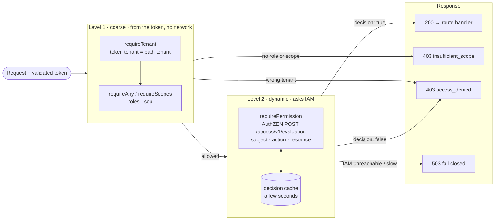
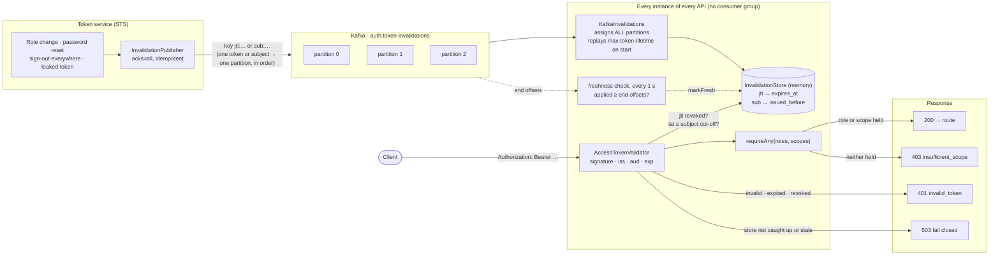
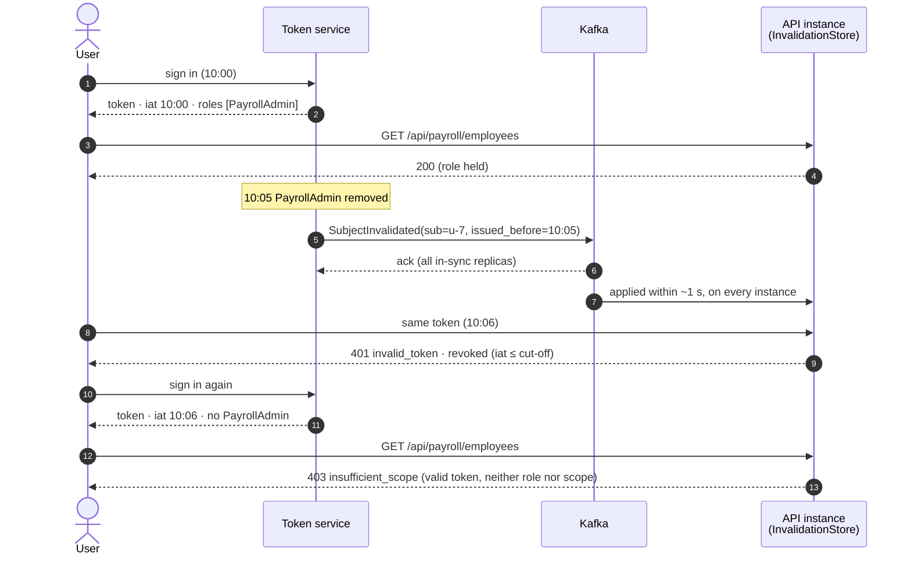
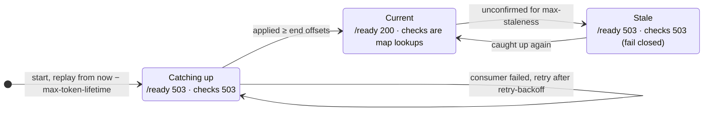

# Token Invalidation

```json
{
  "iss": "https://sts.com",
  "sub": "user-12345",
  "aud": "payroll-api",
  "iat": 1760000000,
  "nbf": 1760000000,
  "exp": 1760001800,
  "jti": "8e8b3d1e-...",
  "tenant": "customer-123",
  "roles": [
    "PayrollAdmin",
    "Manager"
  ],
  "scp": [
    "payroll.read",
    "payroll.write"
  ]
}
```

## Claims contract

What each claim is for, and what the API does when it is wrong or missing:

| Claim | Required | Used for | When wrong or missing |
|---|---|---|---|
| `iss` | yes | Exact match against the trusted issuer | `401 invalid_token` |
| `aud` | yes | Must contain this API's identifier (`payroll-api`) | `401 invalid_token` |
| `sub` | yes | Who the caller is; key for subject-wide invalidation | `401 invalid_token` |
| `iat` | yes | Compared with subject invalidation cut-offs | `401 invalid_token`; also treated as revoked by any cut-off for its subject |
| `nbf` | no | Not accepted before this time (30 s clock skew) | `401 invalid_token` |
| `exp` | yes | Normal expiry | `401 invalid_token` |
| `jti` | yes | Invalidating one specific token | `401 invalid_token`, so no token can dodge the invalidation check |
| `client_id` | yes | Which application is calling; tells user tokens from machine tokens | `401 invalid_token` |
| `tenant` | on tenant-scoped routes | Keeping a caller inside its own tenant | `403 access_denied` |
| `roles` | no | Level 1 authorization (user's role assignments) | Treated as no roles |
| `scp` / `scope` | no | Level 1 authorization (what the client may do on the user's behalf) | Treated as no scopes |

`scp` may be a JSON array, as above, or a space-separated `scope` string (RFC 9068). Both are read.

## Roles

The roles claim represents coarse-grained authorization roles applicable to the token.

```json
"roles": [
  "PayrollAdmin",
  "Manager"
]
```

Roles should be:
- Stable enough to remain useful for the lifetime of the token.
- Limited in number to avoid excessive token size.
- Consistent across consumers.
- Documented as part of the DFID token contract.
- Free of detailed record-level authorization information.

A role in a token is a snapshot from when it was issued. When a role is removed, tokens already issued keep it until they are invalidated (see [Role Changes](#role-changes)) or until the API asks IAM directly ([Level 2](#level-2-dynamic-authorization)).

### Roles and scopes answer different questions

- **`roles`: what the user is.** Their assignments in IAM, such as `PayrollAdmin`.
- **`scp`: what the client application may do on the user's behalf.** The user consented to these, or the application was granted them.

A scope does not give a user anything they don't already have. It only limits what the application can do in their name. So for a token that acts for a user, "role OR scope" lets **any application granted `payroll.read` read payroll for any user, whatever their role**. That is usually right only for machine (`client_credentials`) tokens, which have no user and no roles.

For user tokens, require both by nesting the checks:

```scala
// The user must be a PayrollAdmin AND the application must hold payroll.read.
AccessTokenAuth.requireScopes(Set(ScopeToken("payroll.read")))(
  AccessTokenAuth.requireAny(roles = Set(Role("PayrollAdmin")))(payrollRoutes)
)
```

## jti

A unique `jti` claim is required for access tokens participating in the invalidation model.

```json
"jti": "8e8b3d1e-5ef8-4de8-9f17-..."
```

The `jti` identifies one specific token for invalidation. That is better than identifying a token by its full JWT value, which is long, and which would put a usable credential into every log line and event that names it.

`jti` is in the required claims by default. If it were optional, a token without one would skip the per-token invalidation check.

## exp

The `exp` claim remains the normal expiration mechanism. Token expiration is still required even when invalidation is introduced. Invalidation doesn't replace a short token lifetime; it covers the time between an event and `exp`. The shorter the lifetime, the less there is to invalidate and the smaller each API's invalidation store.

The security model becomes:

```text
Token is valid if:
    signature is valid
AND issuer is trusted
AND audience is correct
AND token is within nbf/exp
AND token has not been invalidated
```

In the order the middleware checks them, with what each failure returns:

| # | Check | Failure |
|---|---|---|
| 1 | One `Authorization` header, Bearer or DPoP, no token in the query string | `400 invalid_request` or `401` |
| 2 | Length at most 8 KB; compact JWS with 3 parts | `401 invalid_token` |
| 3 | `typ` is `at+jwt` (or `JWT`); `alg` is an allowed asymmetric algorithm (RS256, PS256, ES256; never HMAC or `none`) | `401 invalid_token` |
| 4 | Signature against the issuer's JWKS (cached; refreshed on an unknown `kid`) | `401 invalid_token`; `503` if the keys can't be fetched |
| 5 | `iss` exact, `aud` contains this API, `exp`/`nbf`/`iat` within 30 s skew, required claims present | `401 invalid_token` |
| 6 | Not invalidated: `jti` not revoked, `iat` after the subject's cut-off | `401 invalid_token`; `503` if the invalidation store can't vouch for its answer |
| 7 | Sender constraint, if the token has `cnf`: DPoP proof or mTLS certificate matches | `401` |
| 8 | Level 1, then Level 2 authorization (below) | `403`; `503` if IAM can't answer |

## Authorization Model

The architecture should explicitly separate authorization into two levels.



### Level 1: Coarse-grained authorization

The receiving API validates the token and evaluates claims such as:

```text
roles
scp
tenant
audience
issuer
```

This level answers questions such as "Is this caller allowed to invoke this API operation at all?":

```http
POST /payroll/run
Required:
    role = PayrollAdmin
```

The service can make this decision without a synchronous call to Identity and Access Management.

In this service:

- **Roles and scopes:** `requireAny(roles, scopes)` for "any of", `requireScopes(scopes)` for "all of". Nest them for "role AND scope". A valid token that fails gets `403 insufficient_scope`.
- **Tenant:** `requireTenant(tenantOf)` compares the token's `tenant` with the tenant the request targets (for example the `{tenant}` in `/tenants/{tenant}/payroll`). A mismatch, or a token with no tenant, gets `403 access_denied`, before anything else runs. This check stops a valid token for customer A from reading customer B's data.

### Level 2: Dynamic authorization

Identity and Access Management (IAM) should be consulted when the decision depends on current state or resource-specific policy.

Examples:

- Can user access Employee 123?
- Can user access employees in Collection X?
- Can Manager update this specific employee?
- Does the user's current role have access to this feature?
- Does a policy allow access to this resource?

The conceptual model is:

```text
JWT
 |
 +-- Identity
 +-- Tenant
 +-- Roles
 +-- Scopes
 |
 +--> Coarse authorization

Access Management
 |
 +-- Feature access
 +-- Collection access
 +-- Record access
 +-- Dynamic policy
 |
 +--> Fine-grained authorization
```

In this service, `requirePermission(evaluator, action, resourceOf)` asks IAM's policy decision point (PDP). The request uses the OpenID **AuthZEN** Authorization API, so any conformant PDP can answer it:

```http
POST https://iam.example/access/v1/evaluation
Authorization: Bearer <PDP credential>

{
  "subject":  {"type": "user", "id": "user-12345",
               "properties": {"tenant": "customer-123", "client_id": "payroll-web"}},
  "action":   {"name": "can_read"},
  "resource": {"type": "employee", "id": "123"}
}
```

```json
{"decision": true}
```

- **Allowed:** the route runs. **Denied:** `403 access_denied`. **PDP unreachable, erroring or slower than `requestTimeout`** (2 s by default): `503`, never a guess.
- **The token's roles are not sent.** Whether the user's roles, as they are now, allow the action is what the PDP is asked, from its own current data. This is also the answer to the role-snapshot problem for sensitive operations: a role removed in IAM takes effect on the next call, with no new token and no invalidation event.
- **A machine token** (no user present) is sent as `{"type": "client", "id": "<client_id>"}`.
- **Decisions are cached per identical request for `cacheTtl`** (5 s by default; `0` turns caching off). The TTL is the worst-case delay before an IAM change takes effect on a node. Errors are never cached.
- **Put Level 2 inside Level 1**, as in the diagram. A request the token's claims already refuse then never costs an IAM call.

Which level to use:

| Question | Level | Cost per request |
|---|---|---|
| May this caller use this API or operation at all? | 1 | None: claims already in memory |
| Is the caller in the right tenant? | 1 | None |
| May this user see this record, or this collection? | 2 | One PDP call (or a cache hit) |
| Does the user's role, as it is **now**, allow this? | 2 | One PDP call (or a cache hit) |

The two levels are complementary. Level 1 with [invalidation](#consumer-invalidation-workflow) keeps most requests free of any network call and still revokes within about a second. Level 2 is for the decisions a token can't carry.

### example endpoint
```http
GET /api/payroll/employees
```
```text
Policy:
Requires:
    PayrollAdmin
OR
    payroll.read
```
The authorization middleware could effectively perform:
```text
if token.invalid:
    return 401
if token lacks required role/scope:
    return 403
continue request
```
The distinction is important:

### *401 Unauthorized*

The caller does not present a valid authentication credential.

Examples:
- Expired token.
- Invalid signature.
- Invalid issuer.
- Invalid audience.
- Token explicitly invalidated.

### *403 Forbidden*

The token is valid, but the caller lacks the required authorization.

Example:
*Valid token + No PayrollAdmin role + No payroll.read scope = 403*


## Consumer Invalidation Workflow

Each token-consuming service subscribes to the invalidation event stream.
```text
                       STS
                        |
                        |
                Token invalidated
                        |
                        v
                      Kafka
                        |
           +------------+------------+
           |            |            |
           v            v            v
        API A         API B        API C
           |            |            |
           v            v            v
      Local revoke  Local revoke  Local revoke
        store          store         store
```
When a consumer receives:
```text
TokenInvalidated(jti=ABC)   
```
it adds the token identifier to its local invalidation cache/store.

Subsequent requests containing that token are rejected.

### Production flow

What each piece does, and what the client gets back. [What every consumer must do](#what-every-consumer-must-do) explains the rules behind it.



### Role Changes

Adding role claims introduces an important lifecycle question.

Example:
```text
10:00
User receives:
    roles = [Manager]
10:05
Manager role removed.
10:06
User presents existing token.
```
The token still contains:
```text
"roles": ["Manager"]
```
Therefore, role claims alone do not provide immediate role revocation.

There are two possible approaches.

### Option A: Invalidate tokens when roles change

When a security-relevant authorization change occurs:
```text
Role change
   |
   v
Invalidate affected tokens
   |
   v
Publish Kafka event
   |
   v
Consumers revoke token
```
The user then obtains a new token containing the updated roles.

Option A needs the STS to know every token the user holds, so that it can publish one `TokenInvalidated(jti)` per token. Most token services don't track issued access tokens, and a user with several devices or sessions holds several.

### Option B: Invalidate the subject (implemented)

Publish one event for the user instead of one per token:

```text
SubjectInvalidated(sub=u-7, issued_before=10:05)
```

Consumers reject every token for `u-7` whose `iat` is at or before 10:05. The STS needs no record of which tokens are out. The same event covers every change the token carries: roles or groups changed, password reset, account disabled, "sign out everywhere".

With the example above:



`iat` has whole-second precision, so a token issued in the same second as the cut-off can't be placed before or after it. It counts as revoked: at worst a token minted just after the change is rejected once, and the client fetches another.

The `jti` form stays for revoking one specific token, such as a leaked one.

## What every consumer must do

The workflow sketch at the top leaves out some behaviours that decide whether revocation actually works. The [production flow](#production-flow) shows where each one happens.

**Every instance reads every partition.** If API A runs three instances in one consumer group, Kafka splits the partitions between them, and each instance sees only a third of the invalidations. Each instance must consume the whole topic. The implementation assigns itself every partition and uses no consumer group.

**A starting instance catches up before it serves.** A new or restarted instance has an empty store. It replays the topic from `now - max token lifetime`; anything older only revokes tokens that have expired anyway. Until it has caught up it reports not ready and answers revocation checks with `503`, never with a guess.

**A stalled feed fails closed.** Every second the instance records the topic's end offsets. Once it has applied everything up to them, it knows it had every invalidation published before that moment. If it can't confirm this for `max-staleness` (30 s by default), because the broker is unreachable or the consumer is stuck, revocation checks return `503`.

**Entries expire with their tokens.** A `jti` entry is dropped once its token has expired, and a subject entry once `max token lifetime` has passed after its cut-off. Memory is bounded by one token lifetime of invalidations, not by history.

**A bad record is skipped, not retried.** A record that isn't a valid invalidation can never become one. It is logged at ERROR and skipped, so it can't block the invalidations behind it.

**The topic must exist.** The consumer never auto-creates it. With a mistyped topic name, an instance would otherwise follow a new empty topic, report ready, and never see a revocation.

**Publish before you confirm.** The STS should report a revocation as done only after the broker has acknowledged the event (`acks=all`). Only then is it certain to reach every consumer.

### An instance's view of the feed



| Setting (`app.revocation.kafka`) | Default | What it controls |
|---|---|---|
| `max-token-lifetime` | 1 hour | How far back a starting instance replays the topic. Set it to the longest access-token lifetime the STS issues. Topic retention must be at least this long. |
| `max-staleness` | 30 s | How long the copy may go unconfirmed before revocation checks fail closed |
| `freshness-check-interval` | 1 s | How often end offsets are compared with what has been applied |
| `retry-backoff` | 2 s | Wait before rebuilding a failed consumer |

## Wire format

One JSON object per record. The record key keeps every event for one token or one subject on one partition, in order:

```text
key jti:ABC   {"type":"token","jti":"ABC","expires_at":"2026-10-01T10:00:00Z"}
key sub:u-7   {"type":"subject","sub":"u-7","issued_before":"2026-10-01T10:05:00Z","reason":"roles-changed"}
```

Topic retention must be at least the longest access-token lifetime. Compaction on the key also works: it keeps the latest event for each token or subject.

## In this service

| Piece | Where |
|---|---|
| Role OR scope policy (`403` when neither) | `AccessTokenAuth.requireAny(roles, scopes)` |
| Roles, tenant and `iat` on the context | `AuthContext.roles`, `AuthContext.tenant`, `AuthContext.issuedAt` |
| Tenant isolation (`403 access_denied`) | `AccessTokenAuth.requireTenant(tenantOf)` |
| Level 2: ask IAM's PDP (AuthZEN), cached, fail closed | `AccessTokenAuth.requirePermission(evaluator, action, resourceOf)`, `auth.authorization.AccessEvaluator.authZen` |
| Local store (`jti` and subject cut-offs, readiness, staleness) | `auth.revocation.InvalidationStore` |
| Kafka consumer | `app.infra.kafka.KafkaInvalidations` |
| Publisher for the STS side | `app.infra.kafka.InvalidationPublisher` |
| Wire format | `app.infra.kafka.InvalidationCodec` |

Turn it on with `REVOCATION_KAFKA_ENABLED=true` and `KAFKA_BOOTSTRAP_SERVERS`, under `app.revocation.kafka` in `application.conf`. Revocation checks then read the local store instead of the shared Redis or Postgres denylist. Each check is a map lookup, and the per-node revocation cache is switched off because it would only delay revocations.

```scala
// GET /api/payroll/employees: PayrollAdmin OR payroll.read
AccessTokenAuth.requireAny(roles = Set(Role("PayrollAdmin")), scopes = Set(ScopeToken("payroll.read")))(
  payrollRoutes
)
```
