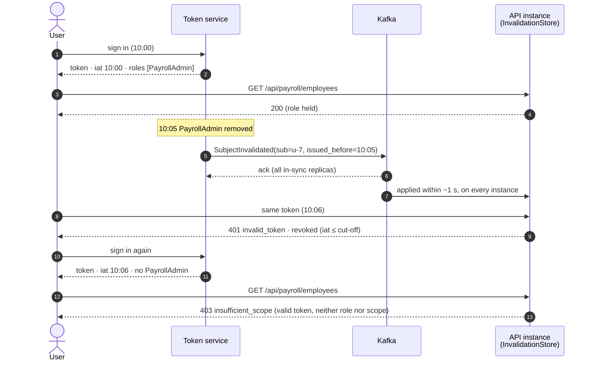
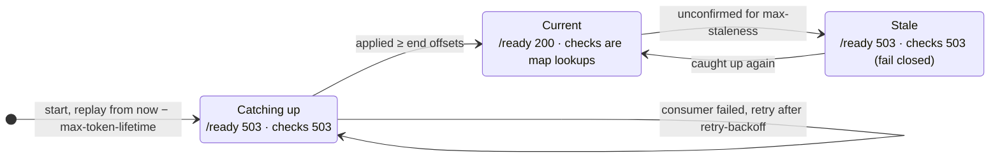

### example endpoint
```http
GET /api/payroll/employees
```
```text
Policy:
Requires:
    PayrollAdmin
OR
    payroll.read
```
The authorization middleware could effectively perform:
```text
if token.invalid:
    return 401
if token lacks required role/scope:
    return 403
continue request
```
The distinction is important:

### *401 Unauthorized*

The caller does not present a valid authentication credential.

Examples:
- Expired token.
- Invalid signature.
- Invalid issuer.
- Invalid audience.
- Token explicitly invalidated.

### *403 Forbidden*

The token is valid, but the caller lacks the required authorization.

Example:
*Valid token + No PayrollAdmin role + No payroll.read scope = 403*


## Consumer Invalidation Workflow

Each token-consuming service subscribes to the invalidation event stream.
```text
                       STS
                        |
                        |
                Token invalidated
                        |
                        v
                      Kafka
                        |
           +------------+------------+
           |            |            |
           v            v            v
        API A         API B        API C
           |            |            |
           v            v            v
      Local revoke  Local revoke  Local revoke
        store          store         store
```
When a consumer receives:
```text
TokenInvalidated(jti=ABC)   
```
it adds the token identifier to its local invalidation cache/store.

Subsequent requests containing that token are rejected.

### Production flow

What each piece does, and what the client gets back. [What every consumer must do](#what-every-consumer-must-do) explains the rules behind it.


### Role Changes

Adding role claims introduces an important lifecycle question.

Example:
```text
10:00
User receives:
    roles = [Manager]
10:05
Manager role removed.
10:06
User presents existing token.
```
The token still contains:
```text
"roles": ["Manager"]
```
Therefore, role claims alone do not provide immediate role revocation.

There are two possible approaches.

### Option A: Invalidate tokens when roles change

When a security-relevant authorization change occurs:
```text
Role change
   |
   v
Invalidate affected tokens
   |
   v
Publish Kafka event
   |
   v
Consumers revoke token
```
The user then obtains a new token containing the updated roles.

Option A needs the STS to know every token the user holds, so that it can publish one `TokenInvalidated(jti)` per token. Most token services don't track issued access tokens, and a user with several devices or sessions holds several.

### Option B: Invalidate the subject (implemented)

Publish one event for the user instead of one per token:

```text
SubjectInvalidated(sub=u-7, issued_before=10:05)
```

Consumers reject every token for `u-7` whose `iat` is at or before 10:05. The STS needs no record of which tokens are out. The same event covers every change the token carries: roles or groups changed, password reset, account disabled, "sign out everywhere".

With the example above:



`iat` has whole-second precision, so a token issued in the same second as the cut-off can't be placed before or after it. It counts as revoked: at worst a token minted just after the change is rejected once, and the client fetches another.

The `jti` form stays for revoking one specific token, such as a leaked one.

## What every consumer must do

The workflow sketch at the top leaves out some behaviours that decide whether revocation actually works. The [production flow](#production-flow) shows where each one happens.

**Every instance reads every partition.** If API A runs three instances in one consumer group, Kafka splits the partitions between them, and each instance sees only a third of the invalidations. Each instance must consume the whole topic. The implementation assigns itself every partition and uses no consumer group.

**A starting instance catches up before it serves.** A new or restarted instance has an empty store. It replays the topic from `now - max token lifetime`; anything older only revokes tokens that have expired anyway. Until it has caught up it reports not ready and answers revocation checks with `503`, never with a guess.

**A stalled feed fails closed.** Every second the instance records the topic's end offsets. Once it has applied everything up to them, it knows it had every invalidation published before that moment. If it can't confirm this for `max-staleness` (30 s by default), because the broker is unreachable or the consumer is stuck, revocation checks return `503`.

**Entries expire with their tokens.** A `jti` entry is dropped once its token has expired, and a subject entry once `max token lifetime` has passed after its cut-off. Memory is bounded by one token lifetime of invalidations, not by history.

**A bad record is skipped, not retried.** A record that isn't a valid invalidation can never become one. It is logged at ERROR and skipped, so it can't block the invalidations behind it.

**The topic must exist.** The consumer never auto-creates it. With a mistyped topic name, an instance would otherwise follow a new empty topic, report ready, and never see a revocation.

**Publish before you confirm.** The STS should report a revocation as done only after the broker has acknowledged the event (`acks=all`). Only then is it certain to reach every consumer.

### An instance's view of the feed



| Setting (`app.revocation.kafka`) | Default | What it controls |
|---|---|---|
| `max-token-lifetime` | 1 hour | How far back a starting instance replays the topic. Set it to the longest access-token lifetime the STS issues. Topic retention must be at least this long. |
| `max-staleness` | 30 s | How long the copy may go unconfirmed before revocation checks fail closed |
| `freshness-check-interval` | 1 s | How often end offsets are compared with what has been applied |
| `retry-backoff` | 2 s | Wait before rebuilding a failed consumer |

## Wire format

One JSON object per record. The record key keeps every event for one token or one subject on one partition, in order:

```text
key jti:ABC   {"type":"token","jti":"ABC","expires_at":"2026-10-01T10:00:00Z"}
key sub:u-7   {"type":"subject","sub":"u-7","issued_before":"2026-10-01T10:05:00Z","reason":"roles-changed"}
```

Topic retention must be at least the longest access-token lifetime. Compaction on the key also works: it keeps the latest event for each token or subject.

## In this service

| Piece | Where |
|---|---|
| Role OR scope policy (`403` when neither) | `AccessTokenAuth.requireAny(roles, scopes)` |
| Roles and `iat` on the context | `AuthContext.roles`, `AuthContext.issuedAt` (the `roles` claim) |
| Local store (`jti` and subject cut-offs, readiness, staleness) | `auth.revocation.InvalidationStore` |
| Kafka consumer | `app.infra.kafka.KafkaInvalidations` |
| Publisher for the STS side | `app.infra.kafka.InvalidationPublisher` |
| Wire format | `app.infra.kafka.InvalidationCodec` |

Turn it on with `REVOCATION_KAFKA_ENABLED=true` and `KAFKA_BOOTSTRAP_SERVERS`, under `app.revocation.kafka` in `application.conf`. Revocation checks then read the local store instead of the shared Redis or Postgres denylist. Each check is a map lookup, and the per-node revocation cache is switched off because it would only delay revocations.

```scala
// GET /api/payroll/employees: PayrollAdmin OR payroll.read
AccessTokenAuth.requireAny(roles = Set(Role("PayrollAdmin")), scopes = Set(ScopeToken("payroll.read")))(
  payrollRoutes
)
```
